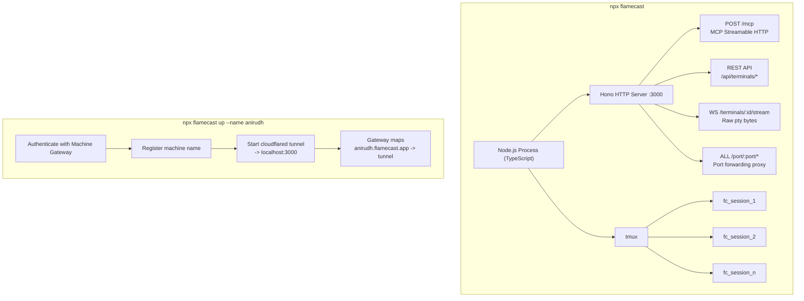
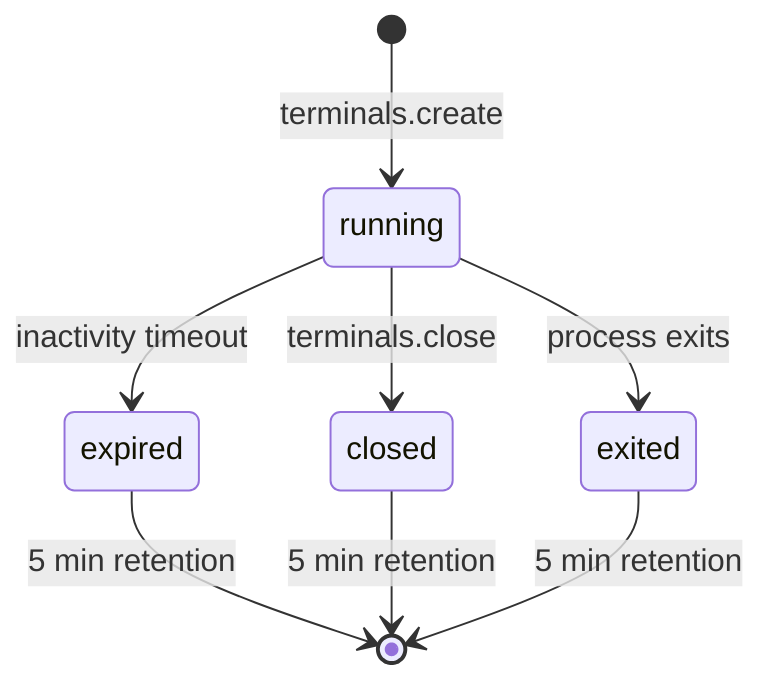
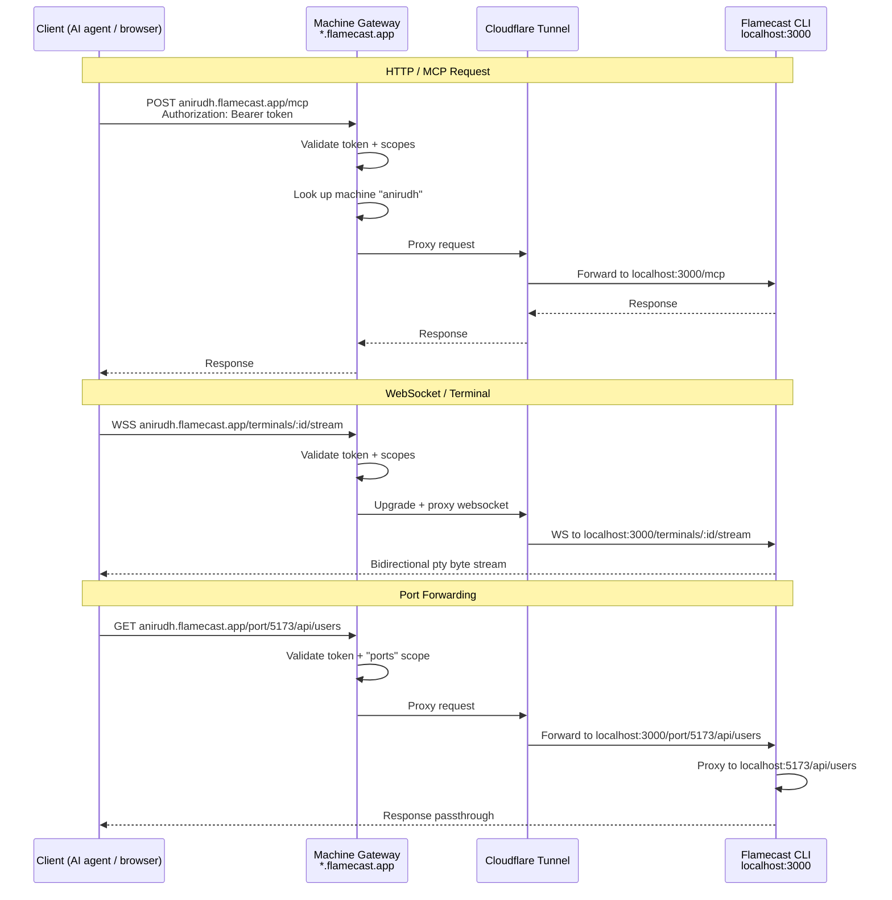
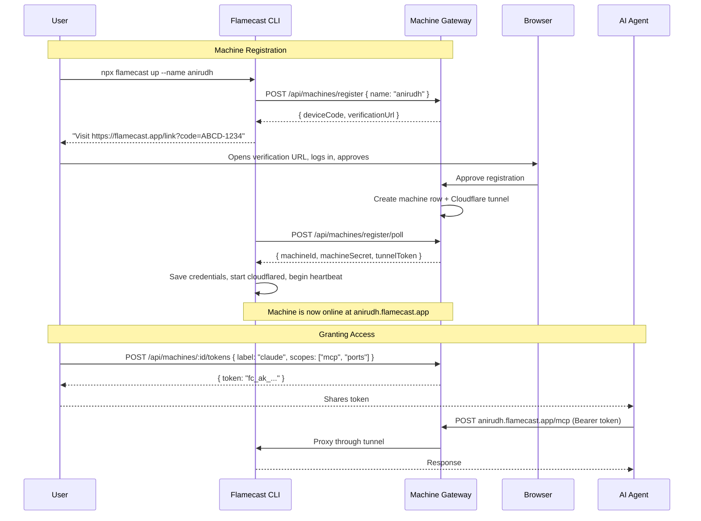

# Flamecast MVP Spec

Flamecast has two components:

1. **Flamecast CLI** -- a local agent (`npx flamecast`) that exposes your machine as an API via MCP tools and raw websocket terminal access. Terminal sessions are backed by tmux for persistence and crash recovery.
2. **Machine Gateway** -- a hosted service at `*.flamecast.app` that registers machines, manages auth, and proxies requests through Cloudflare tunnels to the local Flamecast agent.

---

---

## Part 1: Flamecast CLI (Local Agent)

### System Architecture



The Node process is stateless by design. All terminal session state lives in tmux. If the Node process crashes and restarts, it rediscovers existing `fc_*` tmux sessions and repopulates its in-memory terminal session map.

---

### System Dependency

**tmux** is required. On startup, check for `tmux` in `$PATH`. If missing, print a clear error with install instructions (`brew install tmux` / `apt install tmux`) and exit 1.

---

### HTTP Endpoints

#### `POST /mcp`

MCP streamable HTTP transport. Each request is a JSON-RPC message, response is a single HTTP response.

#### `WS /terminals/:id/stream`

Raw bidirectional pty stream for terminal clients (xterm.js, etc.).

- **Server -> Client:** raw bytes from tmux pane output (via `tmux pipe-pane` or equivalent)
- **Client -> Server:** raw keystrokes forwarded via `tmux send-keys`
- **Resize:** client sends JSON resize messages `{ "type": "resize", "cols": 80, "rows": 24 }` -> `tmux resize-window`
- **Multiple clients** can connect to the same terminal session simultaneously
- Closing the websocket does NOT kill the terminal session

#### `ALL /port/:port/*`

Port forwarding proxy. Forwards any HTTP request or websocket connection to `localhost:<port>` on the host machine. See [Port Forwarding](#port-forwarding) section below.

#### REST API

Every MCP tool is also exposed as a REST endpoint. The REST API and MCP tools share the same underlying handlers -- the REST routes are a thin HTTP wrapper over the same logic.

| Method   | Path                            | MCP Tool              | Description                         |
| -------- | ------------------------------- | --------------------- | ----------------------------------- |
| `POST`   | `/api/terminals`                | `terminals.create`     | Create a new terminal session       |
| `GET`    | `/api/terminals`                | `terminals.list`       | List all terminal sessions          |
| `GET`    | `/api/terminals/:id`            | `terminals.get`        | Get terminal session output and status |
| `DELETE` | `/api/terminals/:id`            | `terminals.close`      | Kill a terminal session             |
| `POST`   | `/api/terminals/:id/exec`       | `terminals.exec`       | Run a command synchronously         |
| `POST`   | `/api/terminals/:id/exec/async` | `terminals.exec_async` | Run a command without waiting       |
| `POST`   | `/api/terminals/:id/input`      | `terminals.input`      | Send keystrokes / control sequences |

For `terminals.exec` and `terminals.exec_async`, if no `:id` is provided, use `POST /api/terminals/exec` which auto-creates a terminal session (matching the MCP behavior when `sessionId` is null).

**Request/response bodies** are identical to the MCP tool params and return values documented below. All REST endpoints return JSON.

**Query params for GET /api/terminals/:id:** `?tail=50` and `?since=8391` map to the `terminals.get` tool params.

---

### MCP Tools

#### 1. `terminals.create`

Spawn a new terminal session (tmux-backed).

**Params:**
| Name | Type | Default | Description |
|------|------|---------|-------------|
| `cwd` | string | `$HOME` | Working directory |
| `shell` | string | `$SHELL` or `/bin/bash` | Shell to spawn |
| `timeout` | number or null | `300` | Seconds of inactivity before auto-kill. `0` or `null` for never. |

**Returns:**

```json
{
  "sessionId": "fc_a1b2c3",
  "streamUrl": "/terminals/fc_a1b2c3/stream",
  "cwd": "/home/user",
  "shell": "/bin/bash",
  "timeout": 300
}
```

**Implementation:** `tmux new-session -d -s fc_<id> -c <cwd> <shell>`

---

#### 2. `terminals.exec`

Execute a command synchronously in a terminal session. Blocks until the command completes or times out.

**Params:**
| Name | Type | Default | Description |
|------|------|---------|-------------|
| `command` | string | _required_ | Command to execute |
| `sessionId` | string or null | null | Terminal session to run in. If null, auto-creates a new terminal session. |
| `timeout` | number | `30` | Max seconds to wait for completion |

**Returns:**

```json
{
  "sessionId": "fc_a1b2c3",
  "output": "file1.txt\nfile2.txt\n",
  "exitCode": 0
}
```

**Implementation:**

1. Write command to tmux pane via `tmux send-keys`
2. Append a sentinel: `; echo __FC_DONE_${?}__`
3. Poll `tmux capture-pane` for the sentinel
4. Parse exit code from sentinel, return everything before it as output
5. Strip ANSI escape codes from output before returning

---

#### 3. `terminals.exec_async`

Execute a command without waiting for completion. For long-running processes like dev servers, builds, watch modes.

**Params:**
| Name | Type | Default | Description |
|------|------|---------|-------------|
| `command` | string | _required_ | Command to execute |
| `sessionId` | string or null | null | Terminal session to run in. If null, auto-creates a new terminal session. |

**Returns:**

```json
{
  "sessionId": "fc_a1b2c3",
  "status": "running"
}
```

**Implementation:** `tmux send-keys` the command + Enter. No sentinel, no waiting.

---

#### 4. `terminals.input`

Send keystrokes or control sequences to an interactive program (vim, REPLs, prompts, etc.).

**Params:**
| Name | Type | Default | Description |
|------|------|---------|-------------|
| `sessionId` | string | _required_ | Target terminal session |
| `text` | string or null | null | Literal text to type |
| `keys` | string[] or null | null | Special keys to send after text |

**Supported keys:** `enter`, `tab`, `escape`, `space`, `backspace`, `delete`, `up`, `down`, `left`, `right`, `ctrl+a` through `ctrl+z`, `ctrl+c`, `ctrl+d`, `ctrl+\`

**Returns:**

```json
{
  "sessionId": "fc_a1b2c3",
  "sent": true
}
```

**Implementation:**

- `text`: `tmux send-keys -l "<text>"` (the `-l` flag sends literal characters)
- `keys`: map to tmux key names and send via `tmux send-keys`. E.g., `ctrl+c` -> `tmux send-keys C-c`, `enter` -> `tmux send-keys Enter`
- If both `text` and `keys` are provided, send text first, then keys

---

#### 5. `terminals.get`

Read output from a terminal session's buffer.

**Params:**
| Name | Type | Default | Description |
|------|------|---------|-------------|
| `sessionId` | string | _required_ | Target terminal session |
| `tail` | number or null | null | Return only the last N lines |
| `since` | number or null | null | Return output since this byte offset (for incremental reads) |

**Returns:**

```json
{
  "sessionId": "fc_a1b2c3",
  "output": "...",
  "lineCount": 142,
  "byteOffset": 8391,
  "status": "running",
  "exitCode": null,
  "cwd": "/home/user/project",
  "streamUrl": "/terminals/fc_a1b2c3/stream"
}
```

**`status` values:** `running`, `exited`, `expired` (timed out), `closed` (manually closed)

**Implementation:**

- `tmux capture-pane -p -t fc_<id> -S -<tail>` for tail reads
- Maintain an in-memory ring buffer (10,000 lines or 1MB cap) per terminal session fed by `tmux pipe-pane` for offset-based reads
- `cwd`: read from `/proc/<pid>/cwd` (Linux) or `lsof -p <pid>` (macOS)

---

#### 6. `terminals.list`

List all active and recently-closed terminal sessions.

**Params:** none

**Returns:**

```json
{
  "sessions": [
    {
      "sessionId": "fc_a1b2c3",
      "status": "running",
      "cwd": "/home/user/project",
      "shell": "/bin/bash",
      "created": "2026-04-15T10:30:00Z",
      "lastActivity": "2026-04-15T10:35:12Z",
      "timeout": 300,
      "streamUrl": "/terminals/fc_a1b2c3/stream"
    }
  ]
}
```

**Implementation:** `tmux list-sessions -F "#{session_name} #{session_created} #{session_activity}"` filtered to `fc_*` prefix, merged with in-memory metadata.

---

#### 7. `terminals.close`

Kill a terminal session and clean up.

**Params:**
| Name | Type | Default | Description |
|------|------|---------|-------------|
| `sessionId` | string | _required_ | Terminal session to close |

**Returns:**

```json
{
  "sessionId": "fc_a1b2c3",
  "finalOutput": "... last buffer contents ...",
  "status": "closed"
}
```

**Implementation:**

1. Capture final pane output via `tmux capture-pane`
2. `tmux kill-session -t fc_<id>`
3. Clean up in-memory state
4. Hold metadata as `closed` for 5 minutes before fully reaping

---

### Port Forwarding

Flamecast acts as a reverse proxy to any port on the host machine. This enables use cases like:

- **Dev servers:** Run `npm run dev` on port 5173, access it at `anirudh.flamecast.app/port/5173/`
- **CDP websockets:** Launch a headless browser with `--remote-debugging-port=9222`, connect to `wss://anirudh.flamecast.app/port/9222/devtools/browser/<id>` to control it via Chrome DevTools Protocol
- **Any local service:** Databases, APIs, admin panels -- anything listening on a TCP port

#### How it works

`/port/:port/*` is a catch-all proxy on the Flamecast HTTP server. It handles both HTTP and websocket upgrades.

**HTTP requests:**

```
GET /port/5173/index.html
  -> proxy to http://localhost:5173/index.html
  -> return response with original status, headers, body
```

**Websocket connections:**

```
WS /port/9222/devtools/browser/abc123
  -> upgrade to websocket
  -> open WS connection to ws://localhost:9222/devtools/browser/abc123
  -> bidirectional byte relay between client and local websocket
```

**Implementation:**

- Use `http-proxy` or Hono's built-in proxy capabilities
- Strip `/port/:port` prefix before forwarding (so `/port/5173/api/users` -> `localhost:5173/api/users`)
- Forward all request headers, including `Host` (rewritten to `localhost:<port>`)
- For websocket upgrade requests, detect via `Upgrade: websocket` header and establish bidirectional relay
- Stream response bodies -- don't buffer (important for SSE, chunked responses, large files)
- Return 502 if the target port is not listening
- No body parsing, no content modification -- pure passthrough

**Security:**

- Port forwarding is auth-gated the same as all other endpoints (Bearer token locally, gateway auth remotely)
- When accessed via Machine Gateway, the `ports` scope is required on the access token (see updated scopes below)
- Only `localhost` / `127.0.0.1` is proxied to -- never external hosts
- Consider an optional port allowlist (`--ports 3000,5173,9222`) for linked mode, default to all ports in local mode

**Via Machine Gateway:**

When linked, port forwarding works through the same tunnel:

```
Client -> https://anirudh.flamecast.app/port/5173/api/users
  -> Gateway authenticates (requires "ports" scope)
  -> Proxies through Cloudflare tunnel -> localhost:3000/port/5173/api/users
    -> Flamecast proxies to localhost:5173/api/users
```

For websockets (e.g., CDP):

```
Client -> wss://anirudh.flamecast.app/port/9222/devtools/browser/abc123
  -> Gateway authenticates (requires "ports" scope)
  -> Proxies WS through tunnel -> localhost:3000/port/9222/devtools/browser/abc123
    -> Flamecast relays WS to ws://localhost:9222/devtools/browser/abc123
```

This is a double-proxy (gateway -> flamecast -> local port) but it's the simplest architecture -- Flamecast is the only thing that touches localhost, and the gateway only talks to one tunnel endpoint.

---

### Terminal session lifecycle



- Timeout clock resets on any interaction: `terminals.exec`, `terminals.exec_async`, `terminals.input`, `terminals.get`, websocket connect
- Expired/closed/exited terminal sessions retain their output buffer for 5 minutes
- `terminals.get` on a dead terminal session returns the buffered output + status
- `terminals.exec` on a dead terminal session returns an error with `{ status: "expired" | "closed" | "exited" }`

---

### Crash Recovery

On startup, scan for existing `fc_*` tmux sessions:

1. `tmux list-sessions -F "#{session_name}"` filtered to `fc_` prefix
2. For each found terminal session, reconstruct in-memory state (session ID, pid, cwd)
3. Re-attach `pipe-pane` output listeners
4. Resume timeout timers based on `#{session_activity}`
5. Log recovered terminal sessions to stdout

---

### CLI Interface

Only one Flamecast instance can run per machine. On startup, write a PID file to `~/.flamecast/flamecast.pid`. If the file exists and the process is still alive, print an error and exit: `"Flamecast is already running (PID <n>). Run 'npx flamecast down' to stop it."` Clean up the PID file on graceful shutdown and in `down`.

#### `npx flamecast`

Start the server in local-only mode. Prints:

```
Flamecast running on http://localhost:3000
  MCP endpoint: POST http://localhost:3000/mcp
  Auth token: fc_tok_<random>

  Recovered 2 existing terminal sessions.
```

#### `npx flamecast up --name <n>`

Start the server AND register with Machine Gateway for remote access. Prints:

```
Flamecast running on http://localhost:3000
  MCP endpoint: POST http://localhost:3000/mcp

  Linked as: anirudh.flamecast.app
    MCP:       https://anirudh.flamecast.app/mcp
    Terminal:  wss://anirudh.flamecast.app/terminals/:id/stream
    Ports:     https://anirudh.flamecast.app/port/:port/*

  Auth is managed by Machine Gateway. Local token disabled.
```

**Up flow:**

1. Check PID file -- if another instance is running, exit with error
2. Check for existing credentials at `~/.flamecast/credentials.json` (contains `machineId` + `machineSecret` from a previous `up`)
3. If no credentials, start a device auth flow:
   - POST to `gateway.flamecast.app/api/machines/register` with `{ name: "anirudh" }`
   - Returns `{ deviceCode, verificationUrl }` -- print the URL for the user to visit and approve in browser
   - Poll `gateway.flamecast.app/api/machines/register/poll` until approved
   - On approval, receive `{ machineId, machineSecret, tunnelToken }` and save to `~/.flamecast/credentials.json`
4. Start `cloudflared tunnel` pointing to `localhost:<port>`, using the tunnel token from the gateway
5. Write PID file
6. Send heartbeat to gateway every 30s: `POST gateway.flamecast.app/api/machines/:id/heartbeat`

#### `npx flamecast down`

Stop the running Flamecast instance. Reads PID from `~/.flamecast/flamecast.pid`, sends SIGTERM, waits for graceful shutdown (closes all terminal sessions, stops tunnel, sends offline heartbeat to gateway). Deletes PID file. Does NOT deregister the machine -- credentials persist so `up` can reconnect without re-registering.

To fully deregister and release the name, use `npx flamecast down --deregister`, which also deletes `~/.flamecast/credentials.json` and calls `DELETE /api/machines/:id` on the gateway.

#### Options

| Flag        | Default | Description                                                                        |
| ----------- | ------- | ---------------------------------------------------------------------------------- |
| `--port`    | `3000`  | Port to listen on                                                                  |
| `--no-auth` | false   | Disable auth token (local-only mode only)                                          |
| `--ports`   | all     | Comma-separated allowlist of ports for forwarding (e.g., `--ports 3000,5173,9222`) |

---

### Authentication (Local Mode)

On first run, generate a random auth token and store it at `~/.flamecast/token`. Print it to stdout on startup.

- All HTTP requests must include `Authorization: Bearer <token>`
- Websocket upgrade requests must include the token as a query param: `/terminals/:id/stream?token=<token>`
- `--no-auth` disables this for local development
- When running in linked mode, local auth is disabled -- Machine Gateway handles auth (see Part 2)

---

### Tech Stack (CLI)

- **Runtime:** Node.js + TypeScript
- **HTTP framework:** Hono
- **Websocket:** Hono's built-in websocket support (backed by `ws`)
- **MCP:** `@modelcontextprotocol/sdk` (streamable HTTP transport)
- **Terminal session backend:** tmux (system dependency, no `node-pty`)
- **Port proxy:** `http-proxy` or Hono proxy helpers
- **Tunnel:** `cloudflared` (downloaded on first `up`, or expects it in `$PATH`)
- **Package distribution:** npm (`npx flamecast`)

No native Node addons. Pure JavaScript/TypeScript.

---

---

## Part 2: Machine Gateway (Hosted Service)

Machine Gateway is a hosted service at `gateway.flamecast.app` that acts as the control plane for remote machine access. It handles machine registration, auth, and proxies all requests to the appropriate Cloudflare tunnel.

### Request Flow



---

### Gateway API Endpoints

#### Machine Registration (used by CLI)

**`POST /api/machines/register`**

Start device registration flow. Called by `npx flamecast up`.

Request:

```json
{ "name": "anirudh" }
```

Response:

```json
{
  "deviceCode": "ABCD-1234",
  "verificationUrl": "https://flamecast.app/link?code=ABCD-1234",
  "expiresIn": 300
}
```

Returns 409 if name is already taken.

---

**`POST /api/machines/register/poll`**

Poll for registration approval.

Request:

```json
{ "deviceCode": "ABCD-1234" }
```

Response (pending):

```json
{ "status": "pending" }
```

Response (approved):

```json
{
  "status": "approved",
  "machineId": "mach_abc123",
  "machineSecret": "fc_sec_<random>",
  "tunnelToken": "<cloudflare_tunnel_token>"
}
```

---

**`DELETE /api/machines/:id`**

Deregister a machine. Called by `npx flamecast down --deregister`. Requires `machineSecret` in Authorization header. Tears down the Cloudflare tunnel.

---

#### Machine Lifecycle (used by CLI)

**`POST /api/machines/:id/heartbeat`**

Sent every 30s by the CLI. Updates `last_seen_at`. Gateway marks machines as offline if no heartbeat for 90s.

Request:

```json
{ "machineSecret": "fc_sec_<random>" }
```

Response:

```json
{ "status": "ok" }
```

---

#### Access Management (used by end users / dashboard)

**`POST /api/machines/:id/tokens`**

Create an access token for a machine. This is what end users (or AI agents) use to authenticate requests to `anirudh.flamecast.app`.

Request:

```json
{
  "label": "claude-desktop",
  "scopes": ["mcp", "terminal", "ports"],
  "expiresIn": 86400
}
```

Response:

```json
{
  "token": "fc_ak_<random>",
  "label": "claude-desktop",
  "scopes": ["mcp", "terminal", "ports"],
  "expiresAt": "2026-04-16T10:30:00Z"
}
```

**Scopes:**

- `mcp` -- access to `POST /mcp` and REST API endpoints
- `terminal` -- access to `WS /terminals/:id/stream`
- `ports` -- access to `/port/:port/*` (HTTP and websocket forwarding)

---

**`GET /api/machines/:id/tokens`**

List active tokens for a machine.

---

**`DELETE /api/machines/:id/tokens/:tokenId`**

Revoke a token.

---

#### Proxy (wildcard \*.flamecast.app)

All requests to `<n>.flamecast.app/*` are handled by the proxy:

1. Extract machine name from subdomain
2. Look up machine in DB, verify it's online
3. Validate `Authorization: Bearer <token>` against the machine's access tokens
4. Check token scopes: `mcp` scope required for `/mcp` and `/api/*`, `terminal` scope required for `/terminals/*/stream`, `ports` scope required for `/port/*`
5. Forward the request through the Cloudflare tunnel to the machine's local Flamecast agent
6. Stream the response back to the client (supports websocket upgrade passthrough)

Returns 404 if machine name not found, 401 if invalid token, 403 if scope insufficient, 503 if machine is offline.

---

### Database Schema (Drizzle)

Assumes an existing PostgreSQL database with Drizzle ORM. Three new tables:

```typescript
import { pgTable, text, timestamp, pgEnum } from "drizzle-orm/pg-core";

export const machineStatusEnum = pgEnum("machine_status", ["online", "offline"]);

export const machines = pgTable("machines", {
  id: text("id").primaryKey(), // "mach_abc123"
  ownerId: text("owner_id").notNull(), // FK to your existing users table
  name: text("name").notNull().unique(), // "anirudh" (the subdomain)
  machineSecret: text("machine_secret").notNull(), // hashed, for CLI auth
  tunnelId: text("tunnel_id"), // Cloudflare tunnel ID
  tunnelToken: text("tunnel_token"), // encrypted, for starting cloudflared
  status: machineStatusEnum("status").notNull().default("offline"),
  lastSeenAt: timestamp("last_seen_at", { withTimezone: true }),
  createdAt: timestamp("created_at", { withTimezone: true }).notNull().defaultNow(),
  updatedAt: timestamp("updated_at", { withTimezone: true }).notNull().defaultNow(),
});
```

```typescript
export const machineAccessTokens = pgTable("machine_access_tokens", {
  id: text("id").primaryKey(), // "fc_atok_abc123"
  machineId: text("machine_id")
    .notNull()
    .references(() => machines.id, { onDelete: "cascade" }),
  tokenHash: text("token_hash").notNull(), // hashed token
  label: text("label"), // "claude-desktop"
  scopes: text("scopes").array().notNull().default(["mcp", "terminal", "ports"]),
  expiresAt: timestamp("expires_at", { withTimezone: true }),
  createdAt: timestamp("created_at", { withTimezone: true }).notNull().defaultNow(),
});
```

```typescript
export const registrationStatusEnum = pgEnum("registration_status", [
  "pending",
  "approved",
  "expired",
]);

export const machineRegistrations = pgTable("machine_registrations", {
  deviceCode: text("device_code").primaryKey(), // "ABCD-1234"
  name: text("name").notNull(), // requested machine name
  ownerId: text("owner_id"), // set when user approves
  status: registrationStatusEnum("status").notNull().default("pending"),
  machineId: text("machine_id"), // set on approval
  expiresAt: timestamp("expires_at", { withTimezone: true }).notNull(),
  createdAt: timestamp("created_at", { withTimezone: true }).notNull().defaultNow(),
});
```

**Indexes** (in a migration or via Drizzle's index API):

```typescript
import { index } from "drizzle-orm/pg-core";

// Add to machines table definition
// index("idx_machines_name").on(machines.name)
// index("idx_machines_owner_id").on(machines.ownerId)

// Add to machineAccessTokens table definition
// index("idx_machine_access_tokens_machine_id").on(machineAccessTokens.machineId)
```

---

### Gateway Auth Flow (end-to-end)



---

### Gateway Tech Stack

- **Runtime:** Node.js + TypeScript (or whatever your existing service uses)
- **HTTP framework:** Hono
- **Database:** PostgreSQL (existing) with Drizzle ORM
- **Tunnel management:** Cloudflare Tunnel API
- **Hosting:** wherever your existing infra runs

---

---

## Out of Scope for MVP

- `read_file` / `write_file` MCP tools (use terminal for now)
- Browser-based terminal UI (just the websocket endpoint -- bring your own xterm.js)
- Include/exclude filepath rules on the gateway
- Virtual filesystem with guardrails
- Terminal session sharing between users
- Command allowlists/blocklists
- Audit logging
- Rate limiting on the gateway
