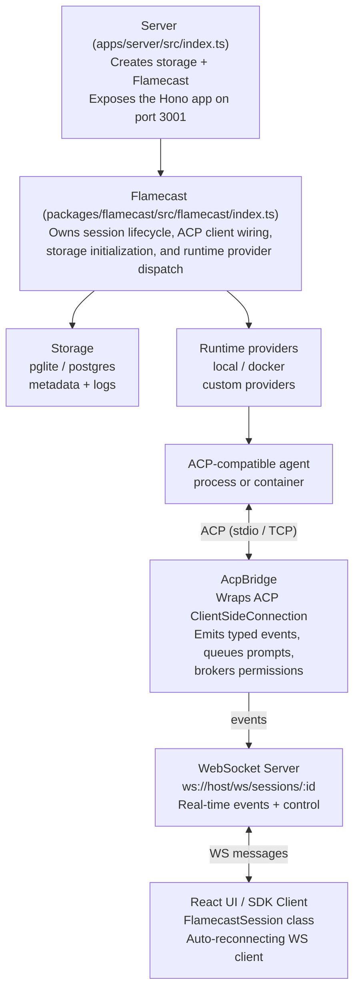
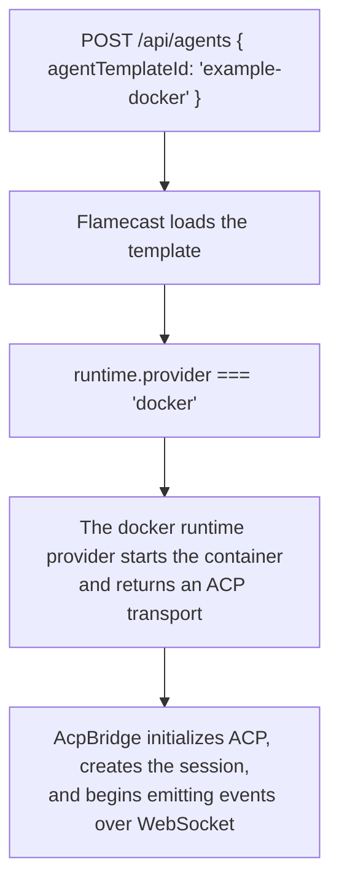

# Flamecast

Flamecast is an open-source, self-hostable control plane for ACP-compatible agents. It starts and manages agent sessions behind a REST API, brokers ACP permission requests, persists session metadata and logs, and ships a reference React UI — all with real-time WebSocket connectivity.

---

## Quick start

```bash
pnpm install
pnpm dev
```

Open **http://localhost:3000**. The home page lists the registered agent templates; click **Start session** on one to launch a session.

---

## Stack

| Layer | Technology |
|---|---|
| Control plane | `Flamecast` class + Hono API + ACP client connection |
| Real-time layer | WebSocket server (`ws`) for live session events and control |
| Bridge | `AcpBridge` + `@acp/runtime-bridge` sidecar for agent ↔ client communication |
| Storage | `FlamecastStorage` with Drizzle-backed PGLite or Postgres backends |
| Runtime providers | Built-in `local` and `docker` providers, plus custom provider registry support |
| Infrastructure | [Alchemy](https://alchemy.run) for Docker provisioning and experimental deployment flows |
| API | [Hono](https://hono.dev/) on Node (`@hono/node-server`), port 3001 |
| Validation | [Zod](https://zod.dev/) schemas in `src/shared/session.ts` and `src/shared/ws-protocol.ts` |
| Client | React 19, Vite 8, TanStack Router + Query, Tailwind v4 |
| Typesafe API | Shared typed client at `@flamecast/sdk/client` |

---

## Architecture



### How it works

1. `Flamecast` uses the caller-provided storage and lazily seeds initial agent templates when the first API call or `listen()` happens.
2. `POST /api/agents` resolves either an `agentTemplateId` or an ad-hoc `spawn` definition.
3. The selected runtime provider starts the agent and returns an ACP transport plus a termination handle.
4. `AcpBridge` wraps the transport in an ACP `ClientSideConnection`, performs `initialize` and `session/new`, and begins emitting typed events (RPC calls, permission requests, logs).
5. `LocalRuntimeClient` pipes bridge events into storage and broadcasts them to subscribed WebSocket clients in real time.
6. The UI connects via `ws://localhost:PORT/ws/sessions/:sessionId` and receives the full event history on connect, then live events as they happen. Control messages (prompts, permission responses, cancellations) flow back over the same WebSocket.

At the moment, each managed agent corresponds to exactly one ACP session. The `/api/agents` routes therefore return the existing session-shaped payloads until a later PR splits agent metadata from session snapshots.

---

## WebSocket protocol

The WebSocket endpoint at `ws://localhost:PORT/ws/sessions/:sessionId` provides real-time bidirectional communication for each session.

### Server → Client messages

| Type | Description |
|---|---|
| `connected` | Confirmation with `sessionId` after handshake |
| `event` | Session event (RPC call, permission request, log entry, filesystem change) |
| `error` | Error message |
| `file.preview` | File content response |
| `fs.snapshot` | Filesystem directory listing |

### Client → Server messages

| Action | Description |
|---|---|
| `prompt` | Send a text prompt to the agent |
| `permission.respond` | Approve or cancel a pending permission request |
| `cancel` | Cancel a queued prompt |
| `terminate` | Kill the session |
| `ping` | Heartbeat |
| `file.preview` | Request file content from the agent workspace |
| `fs.snapshot` | Request a filesystem directory listing |

Schemas are defined in `packages/flamecast/src/shared/ws-protocol.ts`.

---

## AcpBridge

`AcpBridge` (`packages/flamecast/src/runtime/acp-bridge.ts`) is the core adapter between an ACP agent and the Flamecast control plane:

- Wraps an ACP `ClientSideConnection` and implements the `acp.Client` interface
- Emits typed events (`rpc`, `permissionRequest`, `log`) instead of coupling directly to storage
- Queues prompts when another is already executing, ensuring serial execution within a session
- Coalesces streaming text chunks for efficiency
- Manages the permission request lifecycle (receives requests from the agent, awaits user response, relays back)

### Runtime bridge sidecar

The `@acp/runtime-bridge` package (`packages/runtime-bridge/`) is a standalone Node process that can host an agent independently:

- Spawns the agent process and initializes an ACP connection over stdio
- Exposes a WebSocket server for UI or orchestrator connections
- Watches the agent workspace filesystem for changes
- Broadcasts RPC events, logs, and filesystem changes to connected clients

Configuration via environment variables:

| Variable | Description |
|---|---|
| `BRIDGE_PORT` | WebSocket port (`0` = auto-assign) |
| `AGENT_COMMAND` | Command to spawn the agent process (required) |
| `AGENT_ARGS` | JSON array of arguments |
| `AGENT_CWD` | Agent working directory |
| `BRIDGE_WORKSPACE` | Root directory for file operations |
| `FILE_WATCHER_ENABLED` | Enable filesystem watching (default: `true`) |
| `FILE_WATCHER_IGNORE` | JSON array of ignore patterns (default: `["node_modules", ".git"]`) |

---

## Agent templates

Each agent template defines the reusable information needed to launch an agent:

- `id`
- `name`
- `spawn`
- `runtime`

Built-in templates live in `packages/flamecast/src/flamecast/agent-templates.ts`:

```ts
{
  id: "example",
  name: "Example agent",
  spawn: { command: "pnpm", args: ["exec", "tsx", "<resolved package path>/src/flamecast/agent.ts"] },
  runtime: { provider: "local" },
}

{
  id: "example-docker",
  name: "Example agent (Uses stock docker containers)",
  spawn: { command: "pnpm", args: ["exec", "tsx", "agent.ts"] },
  runtime: {
    provider: "docker",
    image: "flamecast/example-agent",
    dockerfile: "<resolved package path>/docker/example-agent.Dockerfile",
  },
}
```

`POST /api/agent-templates` registers additional templates in storage, so they survive Flamecast restarts as long as the configured storage backend is durable.

### Template-driven session creation



You can also create a one-off session without registering a template first:

```json
{
  "spawn": {
    "command": "pnpm",
    "args": ["exec", "tsx", "./agent.ts"]
  },
  "name": "Scratch agent"
}
```

---

## Runtime providers

Runtime providers are responsible for starting the actual agent runtime and returning a live ACP transport.

| Provider | What it does |
|---|---|
| `local` | Uses `child_process.spawn()` and stdio |
| `docker` | Uses `alchemy/docker`, waits for ACP readiness, then connects over TCP |
| `e2b` | Uses [E2B](https://e2b.dev/) sandboxes. Uploads the session-host Go binary, then starts agent sessions inside the sandbox |

### Session-host Go binary

The `docker` and `e2b` runtime providers run agents inside sandboxes. Each sandbox needs the **session-host Go binary** (`packages/session-host-go/`) — a lightweight HTTP/WebSocket server that manages the agent process lifecycle inside the sandbox.

**How the binary is resolved** (in order):

1. **`SESSION_HOST_BINARY` env var** — path to a local binary (used by `docker` provider on the host)
2. **Local `@flamecast/session-host-go` package** — resolved via `import.meta.resolve` (works in Node.js, not in bundled environments)
3. **`SESSION_HOST_URL` env var** — URL to download the binary (for environments without filesystem access like Cloudflare Workers)
4. **Stable GitHub release** — `https://github.com/smithery-ai/flamecast/releases/download/session-host-latest/session-host-amd64`

> **Important:** E2B sandboxes are always x86_64 (amd64). The binary must be compiled for `GOARCH=amd64` regardless of your host architecture.

**Building the binary:**

```bash
cd packages/session-host-go
GOOS=linux GOARCH=amd64 go build -o dist/session-host-amd64 .
```

**Updating the rolling release** (so all deployments pick up the new binary automatically):

```bash
gh release delete session-host-latest -y
gh release create session-host-latest dist/session-host-amd64 \
  --title "session-host (latest)" \
  --notes "Rolling release — always points to the latest session-host-amd64 binary." \
  --prerelease
```

Custom providers can be added through the `runtimeProviders` option:

```ts
import { Flamecast } from "@flamecast/sdk";

const flamecast = new Flamecast({
  runtimeProviders: {
    remote: {
      async start() {
        const transport = await openRemoteTransportSomehow();
        return {
          transport,
          terminate: async () => {
            await transport.dispose?.();
          },
        };
      },
    },
  },
  agentTemplates: [
    {
      id: "remote-agent",
      name: "Remote agent",
      spawn: { command: "remote-agent", args: [] },
      runtime: { provider: "remote" },
    },
  ],
});
```

If you pass `agentTemplates`, they replace the bundled defaults.

---

## Repository layout

```text
apps/
  server/
    src/index.ts            # Node entry point; constructs Flamecast and listens
packages/
  flamecast/
    alchemy.run.ts          # Experimental control plane: Postgres + Worker + Vite
    docker/
      example-agent.Dockerfile
      codex-agent.Dockerfile
    src/
      server/app.ts         # Root Hono app
      worker.ts             # Cloudflare Worker entry point
      flamecast/
        index.ts            # Flamecast class
        api.ts              # REST API routes
        storage.ts          # FlamecastStorage type definitions
        runtime-provider.ts # Built-in runtime providers
        agent-templates.ts  # Built-in agent templates
        transport.ts        # AcpTransport, local/tcp helpers
        agent.ts            # Example ACP agent (stdio + TCP modes)
      runtime/
        acp-bridge.ts       # AcpBridge — ACP ↔ Flamecast event adapter
        client.ts           # RuntimeClient interface
        local.ts            # LocalRuntimeClient — in-process session manager
        ws-server.ts        # FlamecastWsServer — WebSocket event streaming + control
      client/
        lib/
          flamecast-session.ts  # FlamecastSession — auto-reconnecting WS client
          api.ts                # FlamecastClient — typed REST + WS client
        hooks/                  # React hooks (useFlamecastSession, etc.)
        routes/                 # TanStack Router pages
      shared/
        session.ts          # Zod schemas + shared API types
        ws-protocol.ts      # WebSocket message schemas (server ↔ client)
    test/
      flamecast.test.ts     # Orchestration tests
      api.test.ts           # HTTP API contract tests
  flamecast-psql/           # @flamecast/storage-psql — Drizzle-based SQL storage
  runtime-bridge/           # @acp/runtime-bridge — standalone sidecar process
    src/
      index.ts              # Bridge entry point (spawns agent, hosts WS server)
      file-watcher.ts       # Filesystem change watcher
```

---

## Configuration

Configuration is TypeScript via the `Flamecast` constructor:

```ts
import { Flamecast } from "@flamecast/sdk";

const flamecast = new Flamecast({
  storage: "pglite",
});

await flamecast.listen(3001);
```

The same instance also exposes a standard `fetch` handler:

```ts
import { Flamecast } from "@flamecast/sdk";
import { createPsqlStorage } from "@flamecast/storage-psql";

const flamecast = new Flamecast({
  storage: await createPsqlStorage({ url: process.env.DATABASE_URL! }),
});

export default flamecast.fetch;
```

### Constructor options

| Option | Description |
|---|---|
| `storage` | Persistence backend. Required |
| `runtimeProviders` | Registry overrides or additional runtime providers |
| `agentTemplates` | Initial agent template list. Replaces bundled defaults when provided |
| `handleSignals` | Auto shutdown on SIGINT/SIGTERM. Defaults to `true` |
| `runtimeClient` | Custom `RuntimeClient` implementation. Defaults to `LocalRuntimeClient` |

### Storage options

Use `@flamecast/storage-psql` for SQL-backed persistence. `createPsqlStorage()` defaults to embedded PGLite when no `url` is provided:

```ts
import { createPsqlStorage } from "@flamecast/storage-psql";

// Postgres
const storage = await createPsqlStorage({ url: "postgres://localhost/flamecast" });

// Embedded PGLite (default)
const storage = await createPsqlStorage();
```

| Option | Description |
|---|---|
| `url` | Postgres connection string |
| `dataDir` | PGLite data directory (default: `<cwd>/.flamecast/pglite`) |

### Environment variables

| Variable | Purpose |
|---|---|
| `FLAMECAST_PGLITE_DIR` | Override the default PGLite data directory (`<cwd>/.flamecast/pglite`) |
| `SESSION_HOST_BINARY` | Path to a local session-host binary (for docker/local providers) |
| `SESSION_HOST_URL` | URL to download the session-host binary (for e2b/bundled environments). Overrides the default GitHub release URL |

---

## HTTP API

Base URL: `http://localhost:3001/api`

| Method | Path | Description |
|---|---|---|
| `GET` | `/health` | Health check. Returns `{ status, sessions }` |
| `GET` | `/agent-templates` | List available agent templates |
| `POST` | `/agent-templates` | Register a custom agent template |
| `GET` | `/agents` | List active managed agents |
| `POST` | `/agents` | Create a managed agent runtime and session |
| `GET` | `/agents/:agentId` | Get the current agent snapshot (includes `websocketUrl` for live sessions) |
| `DELETE` | `/agents/:agentId` | Terminate a managed agent runtime |

### WebSocket endpoint

| Path | Description |
|---|---|
| `ws://localhost:3001/ws/sessions/:sessionId` | Real-time session events and control |

Session snapshots returned by the REST API include a `websocketUrl` field for active sessions, which clients use to establish a WebSocket connection.

---

## Client SDK

The `FlamecastSession` class (`packages/flamecast/src/client/lib/flamecast-session.ts`) provides a client-side WebSocket wrapper:

```ts
const session = new FlamecastSession({
  websocketUrl: "ws://localhost:3001/ws/sessions/abc-123",
  sessionId: "abc-123",
});

session.connect();

session.on((event) => {
  console.log("Event:", event.type, event.data);
});

session.prompt("Hello, agent!");
session.respondToPermission(requestId, { optionId: "allow" });
session.cancel();
session.terminate();
session.disconnect();
```

Features:
- Auto-reconnects up to 5 times on connection loss (configurable via `maxReconnectAttempts`)
- Buffers all events for the session lifetime
- Exposes `connectionState`: `"disconnected"` | `"connecting"` | `"connected"` | `"reconnecting"`
- File preview requests via `readFile(path)` with promise-based resolution

---

## Deployment

### Local dev (Node)

```bash
pnpm dev
pnpm dev:server
pnpm dev:client
```

### Alchemy / Worker path

`packages/flamecast/alchemy.run.ts` and `packages/flamecast/src/worker.ts` are still experimental. The Worker entry point can serve the API, but the built-in `local` and `docker` providers are intentionally stubbed there and will throw unless you configure a provider that works in that environment.

`pnpm dev` starts both `apps/server` and the frontend in `packages/flamecast`.

---

## Testing

```bash
pnpm test
pnpm check
```

Tests create isolated Flamecast instances and exercise the API surface end-to-end.

---

## Scripts

| Script | Description |
|---|---|
| `pnpm dev` | Start `apps/server` and the frontend dev server |
| `pnpm dev:server` | API only |
| `pnpm dev:client` | Vite only |
| `pnpm test` | Integration tests |
| `pnpm check` | Lint + format + build + API coverage |
| `pnpm fmt` | ESLint fix + Biome format |
| `pnpm alchemy:dev` | Local dev via Alchemy |
| `pnpm alchemy:deploy` | Deploy via Alchemy |
| `pnpm alchemy:destroy` | Tear down Alchemy resources |
| `pnpm psql:generate` | Generate Drizzle migrations |

---

## Current limitations

- No auth or multi-tenancy.
- Single-process control plane; no distributed coordination.
- Worker deployment needs non-local runtime providers.
- Runtime reconnection across process restarts is not implemented yet.

---

## Related docs

- [ACP](https://agentclientprotocol.com/)
- [Alchemy](https://alchemy.run)
