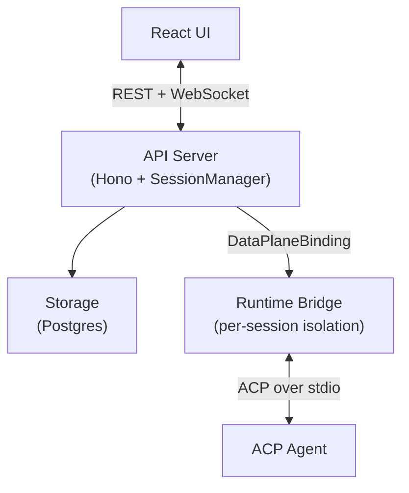

# Flamecast

Flamecast is an open-source, self-hostable control plane for [ACP](https://agentclientprotocol.com/)-compatible agents. It manages agent sessions behind a REST API, brokers permission requests, persists session metadata, and ships a React UI — all with real-time WebSocket connectivity.

Infrastructure is managed with [Alchemy](https://alchemy.run), which handles both local dev and cloud deployment from a single `alchemy.run.ts` definition.

---

## Quick start

```bash
pnpm install
pnpm dev
```

Open **http://localhost:3000**. Click **Start session** on a template to launch an agent.

---

## Deploy

```bash
pnpm alchemy:deploy
```

See [Alchemy deployment docs](https://alchemy.run) for configuring cloud providers and secrets.

---

## Architecture



The **control plane** (API server) is serverless-compatible — no child_process, no Docker, no Node fs. It delegates agent execution to the **data plane** (runtime bridge) via the `DataPlaneBinding` interface. The SessionManager doesn't know whether the bridge is a local process or a cloud container.

Agent templates define what to run:

```json
{
  "name": "My Agent",
  "spawn": { "command": "npx", "args": ["my-acp-agent"] },
  "runtime": { "provider": "container", "setup": "npm install -g my-acp-agent" }
}
```

---

## HTTP API

| Method | Path | Description |
|---|---|---|
| `GET` | `/api/agent-templates` | List available agent templates |
| `POST` | `/api/agent-templates` | Register a custom template |
| `POST` | `/api/agents` | Create a session |
| `GET` | `/api/agents` | List active sessions |
| `GET` | `/api/agents/:id` | Get session snapshot (includes `websocketUrl`) |
| `DELETE` | `/api/agents/:id` | Terminate a session |

Session snapshots include a `websocketUrl` for real-time events and control (prompts, permission responses, cancellation).

---

## Scripts

| Script | Description |
|---|---|
| `pnpm dev` | Full local stack (build + alchemy dev) |
| `pnpm build` | Build all packages |
| `pnpm test` | Run tests |
| `pnpm check` | Lint + format + build + test + knip |
| `pnpm alchemy:deploy` | Deploy to cloud |
| `pnpm alchemy:destroy` | Tear down all resources |
| `pnpm fmt` | Auto-fix lint + format |

---

## Repository layout

```
alchemy.run.ts              # Infrastructure definition
apps/
  worker/src/               # Serverless API entry point
  server/src/               # Node entry point (local fallback)
packages/
  flamecast/src/
    flamecast/              # SessionManager, API routes, DataPlaneBinding
    alchemy/                # Custom Alchemy resources (database, runtime)
    client/                 # React UI
    shared/                 # Zod schemas + API types
  flamecast-psql/           # SQL storage (Drizzle + postgres.js)
  runtime-bridge/           # Agent sidecar (spawns agent, ACP, WebSocket)
```

---

## Related

- [Agent Client Protocol](https://agentclientprotocol.com/)
- [Alchemy](https://alchemy.run)
