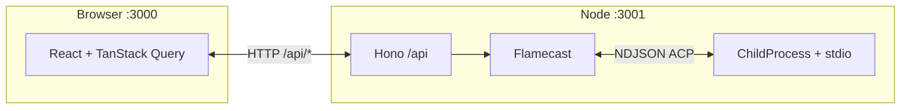

# acp / Flamecast

Local **Agent Client Protocol (ACP)** orchestrator: spawns agent processes, holds **ACP sessions** over NDJSON on stdio, exposes a **REST API**, and ships a small **React** UI to manage connections, send prompts, and resolve permission requests.

For **planned** evolution (sandboxing, durable projection, optional Convex), see [`SPEC.md`](SPEC.md).

---

## Stack

| Layer | Technology |
|--------|------------|
| Orchestration | `Flamecast` class — in-memory state, `@agentclientprotocol/sdk` |
| Agent I/O | `child_process.spawn`, stdin/stdout as Web Streams (`src/flamecast/transport.ts`) |
| API | [Hono](https://hono.dev/) on Node, `@hono/node-server`, port **3001**, mounted at `/api` |
| Validation | [Zod](https://zod.dev/) — shared request/response shapes in `src/shared/connection.ts` |
| Client | React 19, [Vite](https://vitejs.dev/) 8, [TanStack Router](https://tanstack.com/router) + [TanStack Query](https://tanstack.com/query), [Tailwind](https://tailwindcss.com/) v4 |
| Typesafe API client | `hono/client` — `src/client/lib/api.ts` |

---

## Repository layout

```
src/
  client/           # Vite app (port 3000); proxies /api → 3001
    routes/         # TanStack file routes: /, /connections/$id
    components/ui/  # shadcn-style primitives
    lib/api.ts      # hc<AppType> client
  server/
    index.ts        # Hono root, route("/api", api)
    api.ts          # REST handlers → Flamecast
  flamecast/
    index.ts        # Flamecast — connections, ACP client, logs
    transport.ts    # spawn + stdio → streams; built-in agent presets
    agent.ts        # example agent process (tsx) for local dev
  shared/
    connection.ts   # Zod schemas + TS types for API + Flamecast
```

---

## Runtime architecture



- **Single process** owns all connections: one `Flamecast` instance in `api.ts`. No horizontal scaling or persistence across restarts.
- **Agent** is always a **local subprocess** today; Flamecast does not provision containers (see `SPEC.md` Phase 1).

---

## Flamecast (orchestrator)

`Flamecast` (`src/flamecast/index.ts`) is the **runtime authority** for:

| Concern | Implementation |
|---------|----------------|
| Connection registry | `Map<string, ManagedConnection>` — numeric string IDs from a monotonic counter |
| Serializable snapshot | `ConnectionInfo`: label, spawn spec, `sessionId`, timestamps, `logs[]`, `pendingPermission` |
| ACP session | `ClientSideConnection` over `acp.ndJsonStream(stdin, stdout)` |
| OS process | `ChildProcess` from `startAgentProcess` — killed on `DELETE /connections/:id` |
| Permissions | `requestPermission` from agent → UI-facing `PendingPermission` + `Map<requestId, resolver>` until user responds |

**`ManagedConnection`** pairs:

- **`info`** — what the API serializes (copy of logs on read via `snapshotInfo`).
- **`runtime`** — `ClientSideConnection | null`, `ChildProcess` (not sent to clients).

**Client role (ACP “client” side):** Flamecast implements `acp.Client`: session updates and tool notifications become **log entries**; `readTextFile` / `writeTextFile` are stubbed (log + empty response); `requestPermission` blocks until HTTP resolves the pending request.

**Logging:** `pushLog(managed, type, data)` appends `{ timestamp, type, data }` to `info.logs`. Types include `initialized`, `session_created`, `prompt_sent`, `prompt_completed`, `session_update`, `permission_*`, `read_text_file`, `write_text_file`, `killed`, etc.

---

## Agent processes and transport

- **`registerAgentProcess` / built-in presets** — Stored in `agentProcesses` `Map` (UUID for user-registered; built-ins use stable ids from `getBuiltinAgentProcessPresets()` in `transport.ts`, e.g. example `tsx` agent path, Codex ACP via `npx`).
- **`create`** — Requires exactly one of `agentProcessId` (preset) or inline `spawn` + optional `label`; optional `cwd` for `newSession` (defaults `process.cwd()`).
- **Streams** — `getAgentProcess` wires `WritableStream` → stdin, stdout → `ReadableStream<Uint8Array>` for the SDK.

---

## HTTP API

Base URL in dev: `http://localhost:3001/api` (browser uses `http://localhost:3000/api` via Vite proxy).

| Method | Path | Body | Description |
|--------|------|------|-------------|
| `GET` | `/agent-processes` | — | List registerable agent definitions (built-ins + user-registered). |
| `POST` | `/agent-processes` | `RegisterAgentProcessBody` | Register `{ label, spawn }`; returns `AgentProcessInfo` with new `id`. |
| `GET` | `/connections` | — | List all connections (snapshots). |
| `POST` | `/connections` | `CreateConnectionBody` | Spawn agent, `initialize`, `newSession`; `201` + `ConnectionInfo`. |
| `GET` | `/connections/:id` | — | Snapshot for one connection; `404` if unknown. |
| `POST` | `/connections/:id/prompt` | `{ text }` | Run ACP `prompt`; returns prompt result (e.g. `stopReason`). |
| `POST` | `/connections/:id/permissions/:requestId` | `{ optionId }` or `{ outcome: "cancelled" }` | Resolve pending permission. |
| `DELETE` | `/connections/:id` | — | Kill process, remove connection. |

Schemas and TypeScript types: **`src/shared/connection.ts`**.

---

## Web client

- **Routes:** `/` — list connections, create flow; `/connections/$id` — detail, prompt input, permission card, log scroll area.
- **Data loading:** React Query `fetchConnection` / list endpoints; connection detail uses **`refetchInterval: 1000`** so logs and permission state update without push.
- **API helper:** `hc<AppType>("/api")` keeps client aligned with `src/server/api.ts` exports.

---

## Scripts

```bash
npm install
npm run dev          # API (tsx watch) + Vite in parallel
# or separately:
npm run dev:server   # API only :3001
npm run dev:client   # Vite only :3000
```

Open **http://localhost:3000**. Ensure agent binaries (e.g. `npx`, `tsx`) are available if you use presets that need them.

Other scripts: `npm run build`, `npm start` (production build entry — verify `dist` layout for your deploy target), `npm run lint`, `npm run format`, `npm run cli` (separate entrypoint in `src/index.ts`; may not match the latest `CreateConnectionBody` shape).

---

## Current limitations (by design)

- **Core connections are still in-memory** — live ACP sessions do not survive restarts. The integration layer persists installs, bindings, and transcript events, then recreates sessions on demand.
- **Operator UI is still local-first** — the React app has not been expanded into a full integration admin console yet.
- **Single host** — one Node process owns live ACP sessions; there is no distributed coordinator.
- **Push updates** — the web UI still relies on polling, not SSE/WebSocket.

---

## Integrated surfaces

Flamecast now has a minimal shell-first integration layer for Slack and Linear:

- **Inbound surfaces**
  - `POST /api/webhooks/slack`
  - `GET /api/oauth/slack/callback`
  - `POST /api/webhooks/linear/comments`
  - `POST /api/webhooks/linear/agent-sessions`
- **Brokered outbound API access**
  - `ALL /api/integrations/proxy/:service/*`

The integration runtime does **not** hand raw provider secrets to the agent. Instead, integration-backed ACP sessions receive:

- `FLAMECAST_PROXY_BASE`
- `FLAMECAST_PROXY_TOKEN`
- `FLAMECAST_INSTALL_ID`
- `FLAMECAST_SOURCE_PLATFORM`

This is intended for normal shell usage:

```bash
curl "$FLAMECAST_PROXY_BASE/linear/graphql" \
  -H "Proxy-Authorization: Bearer $FLAMECAST_PROXY_TOKEN" \
  -H "Content-Type: application/json" \
  -d '{"query":"{ viewer { id name } }"}'
```

```bash
curl "$FLAMECAST_PROXY_BASE/slack/api/chat.postMessage" \
  -H "Proxy-Authorization: Bearer $FLAMECAST_PROXY_TOKEN" \
  -H "Content-Type: application/json" \
  -d '{"channel":"C123","text":"hello from Flamecast"}'
```

### Required env vars

The integration stack is enabled only when `POSTGRES_URL` (or `DATABASE_URL`) is set.

Core:

```bash
POSTGRES_URL=postgres://...
FLAMECAST_BROKER_ENCRYPTION_KEY=...   # 32-byte base64/hex/utf8 value
FLAMECAST_PROXY_BASE_URL=http://127.0.0.1:3001/api/integrations/proxy
FLAMECAST_BOT_NAME=flamecast
```

Slack:

```bash
SLACK_SIGNING_SECRET=...
SLACK_CLIENT_ID=...
SLACK_CLIENT_SECRET=...
SLACK_ENCRYPTION_KEY=...              # optional, falls back to FLAMECAST_BROKER_ENCRYPTION_KEY
```

Linear:

```bash
LINEAR_WEBHOOK_SECRET=...

# either a direct token:
LINEAR_ACCESS_TOKEN=...

# or app credentials for client_credentials:
LINEAR_CLIENT_ID=...
LINEAR_CLIENT_SECRET=...
LINEAR_APP_SCOPES=read,write,comments:create
```

---

## Related documentation

- **[`SPEC.md`](SPEC.md)** — phased roadmap (sandbox orchestration, projection port, optional Convex).
- **ACP** — protocol and behavior via `@agentclientprotocol/sdk`.
