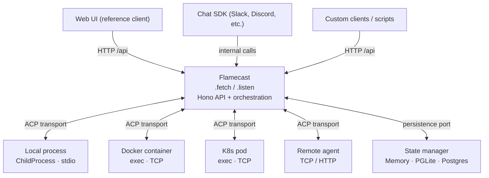

# Architecture

This document describes the architecture for **Flamecast** — an ACP orchestrator that exposes agent management as an HTTP API. Flamecast owns the HTTP layer (Hono), manages agent lifecycle via pluggable provisioners, persists state via pluggable state managers, and optionally integrates with chat platforms via Vercel Chat SDK.

See **PRD.md** for product context and **RFC.md** for the implementation plan.

## Diff from previous architecture

This section summarizes what changed from the original SPEC. The rest of the document reflects the new design.

| Area                              | Before                                                                   | After                                                                                                                                             |
| --------------------------------- | ------------------------------------------------------------------------ | ------------------------------------------------------------------------------------------------------------------------------------------------- |
| **Who owns Hono**                 | `src/server/index.ts` creates Hono app, mounts Flamecast as a dependency | Flamecast owns Hono internally, exposes `.fetch` and `.listen()`                                                                                  |
| **Configuration**                 | `config.yaml` parsed at startup                                          | `FlamecastOptions` in TypeScript — constructor args replace config file                                                                           |
| **Entry point**                   | `src/server/index.ts` wires config → DB → Flamecast → Hono → serve       | `src/index.ts` — 3 lines. Custom config via user's own `index.ts` + build + link                                                                  |
| **Agent lifecycle**               | `ChildProcess` held in memory, dies with orchestrator                    | `Provisioner` interface with `start()` / `reconnect()` / `destroy()`. `SandboxHandle` persisted to DB. Agents can outlive the orchestrator        |
| **Serverless support**            | None — long-running process required                                     | `.fetch` export works on Vercel, Cloudflare, etc. Remote provisioners reconnect per-request                                                       |
| **Transport**                     | Hard-coded `startAgentProcess()` + `getAgentTransport()` returning stdio | `Provisioner` returns `AcpTransport` (same stream shape). Local stdio is one impl; Docker exec, K8s exec, TCP are others                          |
| **`ManagedConnection`**           | `runtime.agentProcess: ChildProcess`                                     | `sandboxHandle: SandboxHandle` (persisted) + `runtime.transport: AcpTransport` or `null` (ephemeral)                                              |
| **Permission flow**               | In-memory Promise resolver, works only in long-running mode              | Same for long-running. Serverless: timeout + poll + re-prompt (v1), persistent channel (future)                                                   |
| **Runtime authority**             | Orchestrator process is always authoritative for liveness                | Depends on provisioner. Local: orchestrator is authoritative. Remote: provisioner is authoritative for liveness, orchestrator reconnects to check |
| **"Thin edge, fat orchestrator"** | Orchestrator must be fat (holds processes)                               | Orchestrator can be thin (serverless) or fat (long-running) — provisioner decides                                                                 |
| **State manager**                 | Described as future work (Phase 2)                                       | Already built — memory and Postgres (PGLite / external) implementations exist                                                                     |
| **Chat integration**              | Not mentioned                                                            | First-class `chat.adapters` option on constructor — Vercel Chat SDK for Slack, Discord, Teams, WhatsApp, etc.                                     |
| **Convex**                        | Phase 3 dedicated to optional Convex integration                         | Removed. State manager interface is vendor-agnostic; Convex can be added as an implementation later if needed                                     |
| **Phases**                        | Phase 1: sandbox orchestration, Phase 2: state manager, Phase 3: Convex  | Phase 1: Flamecast wraps Hono + LocalProvisioner, Phase 2: remote provisioners, Phase 3: Chat SDK + multi-surface                                 |

## 1. Current state

- **`Flamecast`** (`src/flamecast/`): owns ACP `ClientSideConnection`, child processes (via `transport.ts`), permission resolvers, and in-memory `ManagedConnection` runtime state.
- **`FlamecastStateManager`** (`src/flamecast/state-manager.ts`): persistence interface with two implementations — memory and Postgres (PGLite or external via `FLAMECAST_POSTGRES_URL`).
- **`src/server/api.ts`**: Hono HTTP API over a singleton `Flamecast` instance.
- **`src/server/index.ts`**: entry point that wires config, DB, Flamecast, and Hono together.
- **Client** (`src/client/`): TanStack Router + React Query; polls `GET /connections/:id` for logs and permission state.

**What works:** `npx flamecast` from any directory, local child processes, PGLite persistence, web UI.

**What doesn't:** No serverless deployment. No sandboxed agents. Agent lifetime tied to orchestrator process. Config via `config.yaml` instead of code.

## 2. Design principles

1. **API-first.** The HTTP API is the product. The bundled web UI, Chat SDK integrations, and any future clients are consumers of this API. Every agent operation is a REST call.

2. **Two sources of truth, explicit roles.**
   - **Runtime authority:** whatever process holds the ACP session and OS handles (today: `Flamecast`). Authoritative for liveness, in-flight prompts, and pending permissions.
   - **Durable authority:** the state manager. Authoritative for surviving restarts, audit, and multi-client read models.

3. **Write-through state.** When runtime state changes, the orchestrator commits the fact to the state manager. No silent divergence.

4. **Orchestrator can be thin or fat.** With a local provisioner, the orchestrator must be long-running (holds child processes). With a remote provisioner (Docker, K8s, Fly), the orchestrator can be serverless — it reconnects to agents per-request via persisted `SandboxHandle`s.

5. **Transport abstraction.** ACP rides on `{ input: WritableStream, output: ReadableStream }`. The provisioner decides what's behind those streams — local stdio, Docker exec, TCP to a sidecar, Fly machine attach.

6. **Agents don't talk to the store.** The agent process speaks ACP only to Flamecast over the transport. Flamecast observes the protocol, applies policy, and persists via the state manager. DB credentials and write authority stay out of sandbox environments. One writer avoids split-brain.

### 2.1 Persistence port (orchestration → durable)

Flamecast must not import any specific DB SDK directly. Instead:

- The narrow **`FlamecastStateManager`** interface handles lifecycle and log paths: `allocateConnectionId`, `createConnection`, `updateConnection`, `appendLog`, `getConnectionMeta`, `getLogs`, `finalizeConnection`.
- The entry point constructs `Flamecast` with an implementation (memory or Postgres today; others swappable via the same interface).
- All durable writes originate from orchestration. The client does not write to the store for session events.

### 2.2 Event-shaped durable records

Prefer append-only, JSON-serializable events as the unit of persistence: `connection.opened`, `log.appended`, `permission.changed`, `connection.closed`. Materialized `ConnectionInfo` for HTTP can be rebuilt or denormalized from these rows.

### 2.3 Shared types

Connection IDs, log entry shapes, and event payloads live in `src/shared/` (Zod schemas + TS types). All layers (orchestrator, API, client, state manager) share these definitions.

### 2.4 HTTP as the command facade

Commands (create connection, prompt, respond to permission, kill) go through the orchestrator HTTP API. Reads can stay on the same API or move to direct DB queries for history — commands always hit the orchestrator.

## 3. Target architecture



Agents do **not** connect to the store. Only Flamecast uses the persistence port.

## 4. Process management

### 4.1 Provisioner interface

The provisioner replaces the current hard-coded `startAgentProcess()` / `getAgentTransport()`. It manages the full agent lifecycle: start, reconnect, destroy.

```ts
export type SandboxHandle = Record<string, unknown>;

export type AcpTransport = {
  input: WritableStream<Uint8Array>;
  output: ReadableStream<Uint8Array>;
};

export interface Provisioner {
  start(spec: AgentSpawn): Promise<{ handle: SandboxHandle; transport: AcpTransport }>;
  reconnect(handle: SandboxHandle): Promise<AcpTransport>;
  destroy(handle: SandboxHandle): Promise<void>;
}
```

**Key property:** `SandboxHandle` is JSON-serializable and persisted in the state manager. This is what makes reconnection (and therefore serverless) possible.

### 4.2 Implementations

| Provisioner         | Agent lifetime                | Transport          | Reconnectable? |
| ------------------- | ----------------------------- | ------------------ | -------------- |
| `LocalProvisioner`  | Dies with orchestrator        | stdio pipes        | No             |
| `DockerProvisioner` | Survives orchestrator restart | Docker exec / TCP  | Yes            |
| `K8sProvisioner`    | Survives orchestrator restart | K8s exec / TCP     | Yes            |
| `FlyProvisioner`    | Survives orchestrator restart | Fly machine attach | Yes            |
| `RemoteProvisioner` | Independent                   | TCP / HTTP         | Yes            |

### 4.3 `ManagedConnection` lifecycle

**Long-running mode (local provisioner):**

1. `create()` → provisioner starts agent → `SandboxHandle` + transport returned → ACP init + new session → runtime held in memory.
2. `prompt()` → uses held transport → response returned.
3. `kill()` → provisioner destroys agent → connection finalized in state manager.

**Serverless mode (remote provisioner):**

1. `create()` → provisioner starts agent → `SandboxHandle` persisted to DB → ACP init + new session → transport closed after setup.
2. `prompt()` → `provisioner.reconnect(handle)` → opens fresh transport → sends prompt → response returned → transport closed.
3. `kill()` → `provisioner.destroy(handle)` → connection finalized in state manager.

### 4.4 Permission flow

**Long-running:** Same as today — Promise resolver held in memory, resolved when user responds via API.

**Serverless:** The in-memory resolver can't span requests. Options:

- **v1:** Agent blocks on permission. Prompt request times out. Client polls, sees pending permission, approves/denies, re-prompts. Agent retries tool call.
- **Future:** Persistent message channel (Redis pub/sub, provisioner-specific push) to deliver the permission response to the blocked agent.

### 4.5 Policy

Provisioners should support:

- Allowlisted images/commands
- Resource limits (CPU, memory, disk, timeout)
- Network profile (no egress, limited egress, full)
- API maps agent presets to provisioner-specific config

## 5. Flamecast class design

### 5.1 Constructor

```ts
export type FlamecastOptions = {
  stateManager: "psql" | "memory";
  provisioner?: Provisioner; // defaults to LocalProvisioner
  chat?: {
    adapters: ChatAdapter[]; // Vercel Chat SDK adapters
  };
};
```

Constructor is **synchronous** — stores config, loads agent presets, builds Hono routes, binds `.fetch`. No async work.

### 5.2 Lazy init

DB creation and state manager setup happen on first request via `ensureReady()`. Concurrent requests share the same init promise.

### 5.3 `.fetch` and `.listen()`

- `.fetch` is `(req: Request) => Promise<Response>` — the Hono app's fetch handler. Works in any serverless or edge runtime.
- `.listen(port)` is a convenience that calls `@hono/node-server`'s `serve()`. For local dev and CLI use.

### 5.4 Chat SDK integration

When `chat.adapters` are provided:

1. Chat SDK initializes with adapters during `listen()` or on first `fetch`.
2. Incoming messages → `this.prompt()` on the appropriate connection.
3. Pending permissions → interactive approve/deny messages on the platform.
4. Uses the same Flamecast methods as HTTP routes — just another client.

## 6. Entry points

**Default CLI (`src/index.ts`):**

```ts
const flamecast = new Flamecast({ stateManager: "psql" });
flamecast.listen(3001);
```

**Custom config (user's `index.ts`, built + linked):**

```ts
const flamecast = new Flamecast({
  stateManager: "psql",
  provisioner: "docker",
  chat: { adapters: [new SlackAdapter({ ... })] },
});
flamecast.listen(3001);
```

**Serverless (Vercel, Cloudflare):**

```ts
export default flamecast.fetch;
```

## 7. Conflict and failure semantics

| Situation                                   | Rule                                                                                                                                 |
| ------------------------------------------- | ------------------------------------------------------------------------------------------------------------------------------------ |
| Orchestrator up, DB down                    | Fail writes to state manager after runtime success, or queue retries. Define whether API returns 5xx if persistence fails.           |
| DB has connection, runtime does not         | Show "historical" or "reconnect unavailable". Do not pretend session is live. For reconnectable provisioners, attempt `reconnect()`. |
| Two tabs / clients open                     | Both stay in sync via polling (or future realtime). Permission resolution is single-flight per `requestId` on server.                |
| Serverless cold start during active session | `ensureReady()` re-initializes DB connection. `reconnect()` re-establishes transport. ACP session resume TBD.                        |

## 8. Phases

### Phase 1 — Flamecast wraps Hono + LocalProvisioner

**Goal:** Flamecast owns the HTTP layer. `npx flamecast` and custom config both work. API-first design established.

- Move Hono app creation into Flamecast (`.fetch` / `.listen()`).
- `FlamecastOptions` takes `stateManager: "psql" | "memory"`.
- New `src/index.ts` entry point. Delete `config.yaml`, `src/server/config.ts`, `src/server/index.ts`.
- `LocalProvisioner` wraps existing `startAgentProcess` + `getAgentTransport`.
- `Provisioner` interface defined but only local impl ships.

**Exit criteria:** Same functionality as today. `npx flamecast` works. Custom `index.ts` + build + link works. `.fetch` export works (serverless with local provisioner is non-functional but the plumbing exists).

### Phase 2 — Remote provisioners

**Goal:** Agents run in sandboxes. Serverless deployment works end-to-end.

- `DockerProvisioner`, `K8sProvisioner`, `FlyProvisioner` implementations.
- `SandboxHandle` persisted in state manager (new column on `connections` table).
- `reconnect()` path exercised — transport opened per-request.
- Permission flow for serverless (Option A: timeout + re-prompt).

**Exit criteria:** Deploy Flamecast to Vercel with a Fly provisioner. Create a connection, prompt it, approve permissions, kill it — all via the API. Agent runs on Fly, orchestrator runs on Vercel.

### Phase 3 — Chat SDK + multi-surface

**Goal:** Agents reachable from Slack, Discord, Teams, etc. alongside the web UI.

- `chat` option on `FlamecastOptions`.
- Vercel Chat SDK integration: message → prompt, permission → interactive message.
- Connection mapping strategy (per-channel, per-thread, per-user).

**Exit criteria:** A Slack message triggers an agent prompt. Permission request appears as Slack buttons. Response posts back to thread. Same connection visible in web UI.

## 9. Open decisions

- [ ] Auth model for orchestrator API (API keys, OAuth, mTLS).
- [ ] Whether log bodies are capped or paged in the state manager.
- [ ] ACP session resume semantics for `reconnect()` — re-init vs resume handshake.
- [ ] Chat SDK connection mapping — one connection per channel? per thread? per user?
- [ ] Streaming strategy for serverless (SSE, chunked response, or poll-only).

---

_Last updated: architecture for Flamecast — ACP orchestration API._
