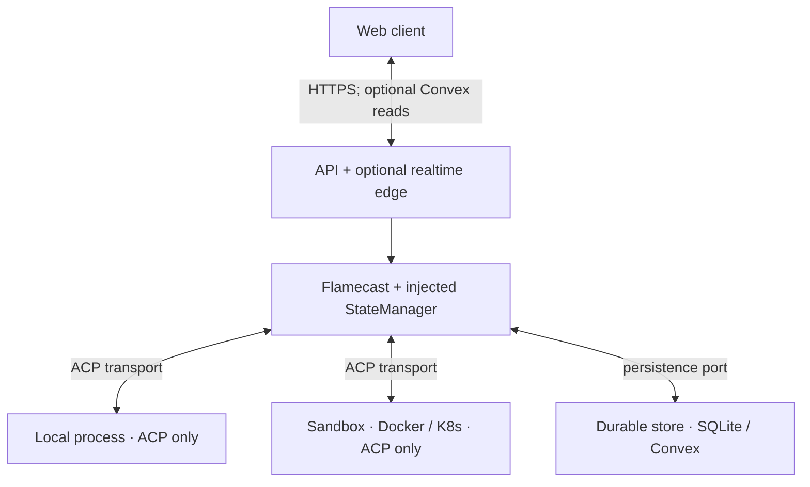

# Rearchitecture plan

This document describes a target architecture for evolving **acp** from a single-process prototype (Hono + in-memory Flamecast) toward a clear split between **orchestration** (live agents), **durable state** (history, config), and **presentation** (web UI). It is a plan, not a commitment to every phase or vendor.

## 1. Current state (baseline)

- **`Flamecast`** (`src/flamecast/`): owns ACP `ClientSideConnection`, child processes, permission resolvers, and in-memory `ConnectionInfo` + logs.
- **`src/server/api.ts`**: HTTP API over a singleton `Flamecast` instance.
- **Client** (`src/client/`): TanStack Router + React Query; connection detail polls `GET /connections/:id` on an interval for logs and permission state.

**Constraint:** Runtime truth (subprocesses, streams, pending promises) cannot live in a database; only **durable state** (via the **state manager**) and **history** can.

## 2. Design principles

1. **Two sources of truth, explicit roles**
   - **Runtime authority:** whatever process holds the ACP session and OS handles (today: `Flamecast`). It is authoritative for _liveness_, _in-flight prompts_, and _pending permissions_.
   - **Durable authority:** a store for _surviving restarts_, _audit_, _multi-client read models_, and _optional realtime fan-out_. Implement as SQLite/Postgres **or** Convex (or similar)—choice is Phase 3.

2. **Write-through state:** when runtime state changes in a way users care to persist, the orchestrator commits the same fact to the durable store (or appends an event). No silent divergence: if the DB is behind, it is _eventually_ consistent; after crash, DB may have partial history while runtime is empty.

3. **Thin edge, fat orchestrator:** serverless/static frontends should not spawn agents. They call an **orchestrator API** that runs where containers/processes are allowed.

4. **Transport abstraction:** ACP rides on `{ input: WritableStream, output: ReadableStream }`. Local `ChildProcess` is one adapter; container attach / sidecar TCP is another (`src/flamecast/transport.ts` evolves into a small interface + implementations).

### 2.1 Persistence port (orchestration → durable)

**Flamecast must not import Convex** (or any specific DB SDK). Instead:

- Define a narrow **`FlamecastStateManager`** (or **`DurableSink`**) interface that Flamecast calls on lifecycle and log paths, e.g. `appendLog`, `upsertConnectionMeta`, `setPendingPermission` / `clearPendingPermission`, `onConnectionClosed`.
- **Server wiring** (`src/server/…`) constructs `Flamecast` with an implementation: in-memory-only, SQLite, or later **`ConvexStateManager`** that forwards to Convex mutations.
- **All durable writes originate from orchestration** (same transaction of intent as runtime actions). The client does not write log rows directly to Convex for session events—avoid split-brain.

This seam is what makes **Phase 3** a swap of the adapter, not a rewrite of ACP logic.

### 2.2 Event-shaped durable records

Prefer **append-only, JSON-serializable events** (optionally versioned) as the unit of persistence, e.g. `connection.opened`, `log.appended`, `permission.changed`, `connection.closed`. Materialized `ConnectionInfo` for HTTP can be rebuilt or denormalized from these rows.

- Maps cleanly to Convex tables with indexes (`by_connection_id`, `by_timestamp`).
- Keeps Flamecast focused on _when_ something happened; storage chooses layout.

### 2.3 Shared types

Keep connection IDs, log entry shapes, and event payloads in **`src/shared/`** (Zod or TS types). When Convex is introduced, **align validators** with these shapes so orchestrator, API, and client stay consistent.

### 2.4 HTTP as the command façade

- **Commands** (create connection, prompt, respond to permission, kill) stay on the **orchestrator HTTP API** unless you explicitly move to another RPC. Convex does not replace Flamecast for _running_ agents.
- **Reads** can remain `GET` on Hono **or** move to Convex `useQuery` for lists/history once durable reads live there—both are valid; commands still hit the orchestrator.

### 2.5 Who talks to the durable store?

**The agent process (local child or code inside Docker/K8s) should not talk to the durable store** for session logs, permissions, or connection metadata.

- It speaks **ACP only** to Flamecast over the transport (stdio, TCP to a sidecar, etc.). Flamecast observes the protocol, applies policy, and **persists via the state manager** through the persistence port.
- **Why:** keeps DB credentials and write authority out of agent/sandbox environments; one writer avoids split-brain; matches today’s model (orchestrator owns `pushLog`).

**Advanced / optional:** a **trusted control-plane sidecar** (not the agent binary) could emit metrics or checkpoints to a store if you design that explicitly—still not the default path for ACP session history; prefer Flamecast as the single writer for orchestration-derived events.

The diagram below shows **Flamecast** as the hub: runtime peers on the left two branches; **durable store** is only on the right branch from Flamecast, not from the sandbox.

## 3. Target logical architecture

Agents do **not** connect to the durable store; only Flamecast uses the persistence port (see §2.5).

## 4. Phases

Phases **1 → 2 → 3** are listed in **recommended build order** when production targets **isolated agents first**, then persistence, then optional hosted Convex. Sandbox and durable store stay orthogonal; Convex does not replace orchestration.

**Pitfall:** Deferring the **`FlamecastStateManager` interface** until the end forces a large retrofit through every log/lifecycle path. Cheap mitigation: add **Phase 2’s** interface with a **no-op** (or tiny JSONL) while still in **Phase 1** if convenient; flesh out storage in Phase 2 and swap **Phase 3**’s adapter when ready.

### Phase 1 — Sandbox orchestration

**Goal:** Replace direct `ChildProcess` with **provisioned sandboxes** for production paths. First milestone when the main unknown is _where and how_ agents run, not yet _where logs are stored_.

- Define **`SandboxHandle`** + **`openAcpTransport(handle)`** returning Web Streams.
- **Provisioner** implementations: local (current behavior), Docker, Kubernetes, etc.
- **Policy:** allowlisted images/commands, resource limits, network profile; API maps presets to provisioner config.
- **Scaling:** sticky routing or one orchestrator worker per active connection for in-memory ACP state.

**Exit criteria:** Same HTTP/API surface for create/prompt/permission; transport implementation swaps.

### Phase 2 — State manager layer (minimal durable model)

**Goal:** Persist enough to survive orchestrator restarts for _read models_ and establish the **persistence port** so Phase 3 is a drop-in.

- Introduce the **`FlamecastStateManager` interface**; **Flamecast** invokes it from `pushLog`, create, kill, and permission paths.
- **Implementation 1:** memory + **SQLite** or append-only **JSONL** under `./data` (minimal deps), or a no-op for fields not yet persisted.
- Prefer **append-only log rows / events** plus optional denormalized connection row for fast list views.
- **API:** `GET /connections/:id` merges **durable state** (history, metadata) with **runtime** (live pending permission, “actually connected”) where both exist.

**Exit criteria:** Restart orchestrator → list and historical logs still load; live session may be gone (document behavior). Flamecast has no direct dependency on a vendor DB.

### Phase 3 — Optional Convex (or keep SQLite/Postgres)

**Goal:** Hosted sync, subscriptions, or ops simplicity—only when the product needs it. Requires **Phase 2’s** state manager port (or a no-op you already added) so the swap is an adapter only.

- Implement **`ConvexStateManager`** (or HTTP calls to Convex mutations from Node) as the only new piece; **Flamecast code stays the same** aside from already using `FlamecastStateManager`.
- Durable rows mirror **shared types** and event shapes from Phase 2.
- Client may use Convex for **reads** (including reactive `useQuery` for live lists/logs) while **commands** stay on the orchestrator HTTP API; alternatively keep polling or manual refetch over REST.

**Rule:** Convex holds **durable state**; Flamecast owns **runtime**. Do not treat “subprocess alive” in Convex as authoritative without clear fields (`last_seen_at`, `runtime_generation`, `status: historical | live`).

## 5. Conflict and failure semantics (document in code + docs)

| Situation                           | Rule                                                                                                                                                         |
| ----------------------------------- | ------------------------------------------------------------------------------------------------------------------------------------------------------------ |
| Orchestrator up, DB down            | Prefer failing writes to the state manager after runtime success, or queue retries; define whether API returns 5xx if persistence fails.                     |
| DB has connection, runtime does not | Show “historical” or “reconnect unavailable”; do not pretend session is live.                                                                                |
| Two tabs open                       | Both stay in sync via Convex subscriptions or by refetching the API; permission resolution is single-flight per `requestId` on server (already one pending). |

## 6. Frontend: logs as markdown (orthogonal)

- Rendering markdown is **client-side** (e.g. `react-markdown`). Cost scales with DOM size → **virtualize** long lists; Convex does not reduce parse cost by itself.
- Optional: derive a small markdown string per log type from `log.data` for readability; fallback to fenced `json` for unknown shapes.

## 7. Open decisions (fill in as the product clarifies)

- [ ] Auth model for orchestrator API (API keys, OAuth, mTLS).
- [ ] Whether log bodies are capped or paged in the state manager.
- [ ] Whether Phase 3 uses Convex, Postgres, or stays SQLite for self-hosted builds.

---

_Last updated: rearchitecture plan for acp / Flamecast evolution._
