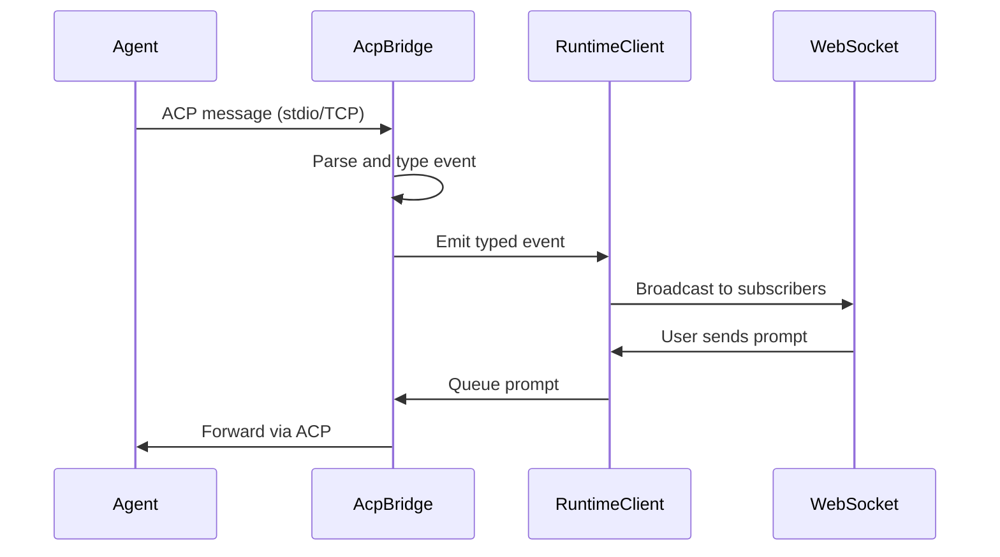

`AcpBridge` is the core adapter that connects an ACP-compatible agent to Flamecast. It lives at `packages/flamecast/src/runtime/acp-bridge.ts`.

## What it does

- Wraps an ACP `ClientSideConnection` and implements the `acp.Client` interface
- Emits typed events (`rpc`, `permissionRequest`, `log`) instead of coupling directly to storage
- Queues prompts when another is already executing, ensuring serial execution within a session
- Coalesces streaming text chunks for efficiency
- Manages the permission request lifecycle: receives requests from the agent, awaits user response, relays back

## Event flow

## Runtime bridge sidecar

The `@acp/runtime-bridge` package (`packages/runtime-bridge/`) is a standalone Node process that can host an agent independently:

- Spawns the agent process and initializes an ACP connection over stdio
- Exposes a WebSocket server for UI or orchestrator connections
- Watches the agent workspace filesystem for changes
- Broadcasts RPC events, logs, and filesystem changes to connected clients

### Configuration

| Variable | Description |
|---|---|
| `BRIDGE_PORT` | WebSocket port (`0` = auto-assign) |
| `AGENT_COMMAND` | Command to spawn the agent process (required) |
| `AGENT_ARGS` | JSON array of arguments |
| `AGENT_CWD` | Agent working directory |
| `BRIDGE_WORKSPACE` | Root directory for file operations |
| `FILE_WATCHER_ENABLED` | Enable filesystem watching (default: `true`) |
| `FILE_WATCHER_IGNORE` | JSON array of ignore patterns (default: `["node_modules", ".git"]`) |
