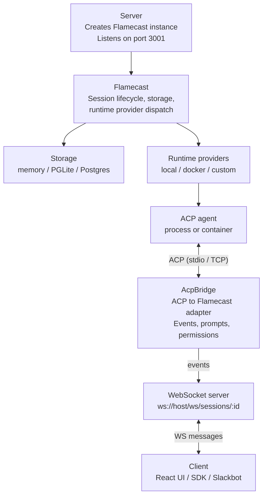
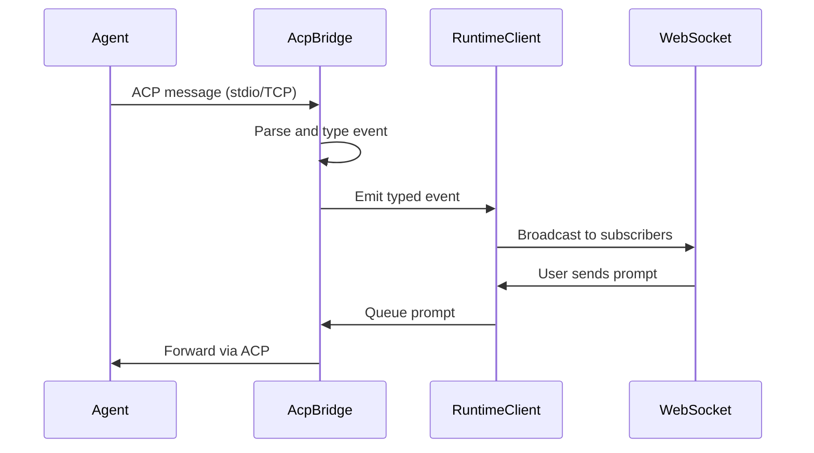

Flamecast is a control plane that sits between ACP-compatible agents and the clients that interact with them. It handles session lifecycle, event streaming, permission brokering, and persistence.

## Component overview



## Request flow

1. **Flamecast** lazily resolves storage and its runtime provider registry on the first API call or `listen()`.
2. `POST /api/agents` resolves either an `agentTemplateId` or an ad-hoc `spawn` definition.
3. The selected **runtime provider** starts the agent and returns an ACP transport plus a termination handle.
4. **AcpBridge** wraps the transport in an ACP `ClientSideConnection`, performs `initialize` and `session/new`, and begins emitting typed events.
5. **LocalRuntimeClient** pipes bridge events into storage and broadcasts them to subscribed WebSocket clients.
6. **Clients** connect via WebSocket, receive the full event history on connect, then live events as they happen. Control messages flow back over the same connection.

## Key abstractions

| Component | Responsibility |
|---|---|
| `Flamecast` | Top-level orchestrator. Owns configuration, storage, and provider registry |
| `AcpBridge` | Adapts an ACP agent connection into typed Flamecast events. Queues prompts serially, coalesces streaming text chunks, and manages permission request lifecycle |
| `LocalRuntimeClient` | In-process session manager. Wires bridge events to storage and WebSocket |
| `FlamecastWsServer` | WebSocket server for real-time event streaming and control |
| `FlamecastStorage` | Interface for persisting session metadata and agent templates |
| `RuntimeProvider` | Interface for starting agents and returning ACP transports |

## AcpBridge

The AcpBridge is the core adapter between ACP agents and Flamecast. It:

- Wraps an ACP `ClientSideConnection` and implements the `acp.Client` interface
- Emits typed events (`rpc`, `permissionRequest`, `log`) instead of coupling directly to storage
- Queues prompts when one is already executing, ensuring serial execution within a session
- Coalesces streaming text chunks for efficiency
- Manages the full permission request lifecycle



## Runtimes

Runtimes are responsible for starting agent processes and returning live ACP transports. You register named runtime instances when constructing Flamecast, then reference them by name in agent templates.

<Note>
  ***Coming soon:*** The named `runtimes` API described below is the planned design. The current implementation uses a lower-level `runtimeProviders` option with a different shape. See [Configuration](/guides/configuration) for current usage.
</Note>

```typescript
const flamecast = new Flamecast({
  runtimes: {
    local: new LocalRuntime(),
    docker: new LocalDockerRuntime(),
    e2b: new E2BRuntime({ apiKey: process.env.E2B_API_KEY }),
  },
});
```

Each runtime is a class instance that knows how to start an agent and return an ACP transport. The name you give it (e.g. `"local"`, `"docker"`, `"e2b"`) is what agent templates reference in their `runtime` field.

| Runtime | How it works |
|---|---|
| `LocalRuntime` | Spawns a child process with `child_process.spawn()`, communicates over stdio |
| `LocalDockerRuntime` | Builds a Docker image, starts a container, waits for ACP readiness, connects over TCP |
| Custom | Any class that implements `start()` returning an `AcpTransport` and a `terminate` function |

See [Orchestrate local agents](/guides/local-agents) and [Orchestrate cloud agents](/guides/cloud-agents) for usage details.

## Agent templates

Agent templates define reusable configurations for launching agents. The `runtime` field is a string that references one of the named runtimes registered on the Flamecast instance:

```typescript
{
  id: "my-agent",
  name: "My agent",
  spawn: { command: "node", args: ["agent.js"] },
  runtime: "local",
}
```

Templates can be registered at construction time, or via `POST /api/agent-templates` so they persist across restarts. See the [REST API reference](/api-reference/endpoints) for details.
