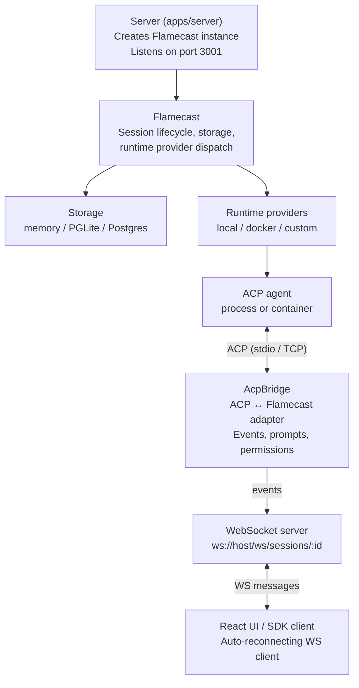

Flamecast is a control plane that sits between ACP-compatible agents and the clients that interact with them. It handles session lifecycle, event streaming, permission brokering, and persistence.

## Component overview

## Request flow

1. **Flamecast** lazily resolves storage and its runtime provider registry on the first API call or `listen()`.
2. `POST /api/agents` resolves either an `agentTemplateId` or an ad-hoc `spawn` definition.
3. The selected **runtime provider** starts the agent and returns an ACP transport plus a termination handle.
4. **AcpBridge** wraps the transport in an ACP `ClientSideConnection`, performs `initialize` and `session/new`, and begins emitting typed events.
5. **LocalRuntimeClient** pipes bridge events into storage and broadcasts them to subscribed WebSocket clients.
6. The **UI** connects via WebSocket, receives the full event history on connect, then live events as they happen. Control messages flow back over the same connection.

## Key abstractions

| Component | Responsibility |
|---|---|
| `Flamecast` | Top-level orchestrator. Owns configuration, storage, and provider registry |
| `AcpBridge` | Adapts an ACP agent connection into typed Flamecast events |
| `LocalRuntimeClient` | In-process session manager. Wires bridge events to storage and WebSocket |
| `FlamecastWsServer` | WebSocket server for real-time event streaming and control |
| `FlamecastStorage` | Interface for persisting session metadata and events |
| `RuntimeProvider` | Interface for starting agents and returning ACP transports |
