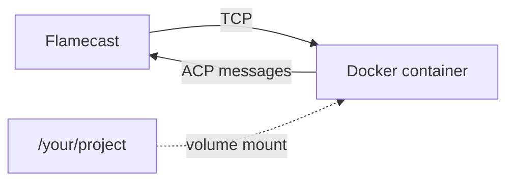

Flamecast isn't limited to local processes. Runtime providers let you start and connect to agents running anywhere — Docker containers, remote servers, Kubernetes pods, or cloud functions.

## Docker runtime

The `LocalDockerRuntime` builds a Docker image, starts a container, and connects to the agent over TCP.

<Note>
  ***Coming soon:*** The `LocalDockerRuntime` class API shown below is the planned design. The current implementation uses a lower-level `runtimeProviders` option. See [Configuration](/guides/configuration) for current usage.
</Note>

### Register a Docker runtime and template

```typescript
const flamecast = new Flamecast({
  runtimes: {
    docker: new LocalDockerRuntime(),
  },
  agentTemplates: [
    {
      id: "my-agent-docker",
      name: "My agent (Docker)",
      spawn: { command: "node", args: ["agent.js"] },
      runtime: "docker",
    },
  ],
});
```

### How it works

1. Flamecast builds the Docker image from the Dockerfile (if configured on the runtime).
2. It finds a free port and starts the container with `ACP_PORT` set as an environment variable.
3. The container runs its `CMD` — the agent process listens for ACP connections on that port over TCP.
4. Flamecast probes the port until the agent is ready, then establishes the ACP connection.
5. The host working directory is mounted at `/workspace` inside the container.

<Note>
  The agent's entry point is defined by the Dockerfile's `CMD`, not the template's `spawn` field. When using a Docker runtime, `spawn` is ignored — the container is responsible for starting the agent process.
</Note>



### Write a Dockerfile for your agent

Your agent needs to listen for ACP connections on the port specified by the `ACP_PORT` environment variable:

```dockerfile
FROM node:22-slim
WORKDIR /app

COPY package.json ./
RUN npm install
COPY . .

EXPOSE 9100
CMD ["node", "agent.js"]
```

In your agent code, listen on `process.env.ACP_PORT`:

```typescript
import * as acp from "@agentclientprotocol/sdk";
import net from "node:net";

const server = net.createServer((socket) => {
  const stream = acp.ndJsonStream(
    ReadableStream.from(socket),
    new WritableStream({ write: (chunk) => socket.write(chunk) })
  );
  new acp.AgentSideConnection((conn) => new MyAgent(conn), stream);
});

server.listen(parseInt(process.env.ACP_PORT || "9100"));
```

## Setup scripts

Agent templates support an optional `setup` string that runs as a shell script inside the container before the agent starts. Use this to install dependencies, pull models, or prepare the workspace:

```typescript
const flamecast = new Flamecast({
  runtimes: {
    docker: new LocalDockerRuntime(),
  },
  agentTemplates: [
    {
      id: "my-agent-docker",
      name: "My agent (Docker)",
      spawn: { command: "node", args: ["agent.js"] },
      setup: "npm install && npm run build",
      runtime: "docker",
    },
  ],
});
```

For Docker runtimes, the `setup` string is executed with `sh -c` inside the container after it starts but before the agent process begins. This is useful when the Dockerfile defines a general-purpose base image and per-session preparation is needed.

<Note>
  ***Coming soon:*** Setup scripts are a planned feature. See the [setup scripts RFC](/rfcs/setup-scripts) for the full design.
</Note>

## Custom runtimes

For agents running on remote infrastructure, register a custom runtime. A runtime is any object with a `start()` method that returns an ACP transport and a termination handle:

<Note>
  ***Coming soon:*** The named `runtimes` API shown below is the planned design. The current implementation uses a lower-level `runtimeProviders` option with a similar shape. See [Configuration](/guides/configuration) for current usage.
</Note>

```typescript
import { Flamecast } from "@flamecast/sdk";

const flamecast = new Flamecast({
  runtimes: {
    local: new LocalRuntime(),
    docker: new LocalDockerRuntime(),
    e2b: new E2BRuntime({ apiKey: process.env.E2B_API_KEY }),
  },
  agentTemplates: [
    {
      id: "cloud-agent",
      name: "Cloud agent",
      spawn: { command: "node", args: ["agent.js"] },
      runtime: "e2b",
    },
  ],
});
```

Each runtime name (e.g. `"local"`, `"docker"`, `"e2b"`) becomes available for use in agent templates. When a session is created, Flamecast looks up the runtime by name and calls its `start()` method.

### Implementing a custom runtime

A runtime's `start()` method must return:

| Field | Type | Description |
|---|---|---|
| `transport` | `AcpTransport` | Readable + writable streams for ACP messages |
| `terminate` | `() => Promise<void>` | Cleanup function to shut down the agent |
| `events` | `ReadableStream<SessionLog>` | Optional stream of filesystem or lifecycle events |
| `agentCwd` | `string` | Optional working directory path from the agent's perspective |

### Transport interface

An `AcpTransport` is a pair of web streams:

```typescript
type AcpTransport = {
  input: WritableStream<Uint8Array>;   // Flamecast writes to agent
  output: ReadableStream<Uint8Array>;  // Flamecast reads from agent
  dispose?: () => Promise<void>;
};
```

Flamecast provides helpers for common transport types:

```typescript
import { openTcpTransport, waitForAcp } from "@flamecast/sdk";

// Connect to a TCP-based agent
await waitForAcp("agent-host", 9100);
const transport = await openTcpTransport("agent-host", 9100);
```

## Runtime bridge sidecar

The `@acp/runtime-bridge` package is a standalone Node process that can host an agent independently. It spawns the agent, manages the ACP connection, and exposes a WebSocket server.

```bash
AGENT_COMMAND="node" \
AGENT_ARGS='["agent.js"]' \
BRIDGE_PORT=0 \
npx @acp/runtime-bridge
```

The bridge prints a JSON readiness message to stdout:

```json
{
  "ready": true,
  "port": 3002,
  "sessionId": "abc-123",
  "websocketUrl": "ws://localhost:3002"
}
```

This is useful for distributing agent hosting across multiple machines, or for running agents in environments where the main Flamecast server can't run directly.
