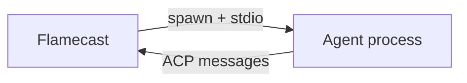

Flamecast can spawn ACP-compatible agents as local child processes and manage their sessions through a unified API. This is the fastest way to get started — no Docker or remote infrastructure needed.

## How it works

The `LocalRuntime` spawns a child process and communicates with the agent over stdio using the ACP protocol. Flamecast handles the ACP handshake, event streaming, prompt queuing, and permission brokering automatically.



## Run a pre-built agent

### Codex

[Codex](https://github.com/zed-industries/codex-acp) is an ACP-compatible coding agent from Zed. Flamecast ships with a built-in template for it:

```bash
curl -X POST http://localhost:3001/api/agents \
  -H "Content-Type: application/json" \
  -d '{ "agentTemplateId": "codex" }'
```

Or register it as a custom template with your own arguments:

```typescript
const flamecast = new Flamecast({
  runtimes: {
    local: new LocalRuntime(),
  },
  agentTemplates: [
    {
      id: "codex",
      name: "Codex",
      spawn: { command: "pnpm", args: ["dlx", "@zed-industries/codex-acp"] },
      runtime: "local",
    },
  ],
});
```

### Claude Code

<Note>
  ***Coming soon:*** Claude Code ACP support is not yet released. The template below shows the expected integration pattern once `claude --acp` is available.
</Note>

```typescript
const flamecast = new Flamecast({
  runtimes: {
    local: new LocalRuntime(),
  },
  agentTemplates: [
    {
      id: "claude-code",
      name: "Claude Code",
      spawn: { command: "claude", args: ["--acp"] },
      runtime: "local",
    },
  ],
});
```

Then start a session:

```bash
curl -X POST http://localhost:3001/api/agents \
  -H "Content-Type: application/json" \
  -d '{ "agentTemplateId": "claude-code" }'
```

### Any ACP agent

Any process that implements the ACP agent interface over stdio works with `LocalRuntime`. Register it as a template:

```typescript
{
  id: "my-agent",
  name: "My agent",
  spawn: { command: "node", args: ["my-agent.js"] },
  runtime: "local",
}
```

## Setup scripts

Agent templates support an optional `setup` string that runs as a shell script before the agent starts. Use this to install dependencies, set up a git worktree, or prepare the workspace:

```typescript
const flamecast = new Flamecast({
  runtimes: {
    local: new LocalRuntime(),
  },
  agentTemplates: [
    {
      id: "my-agent",
      name: "My agent",
      spawn: { command: "node", args: ["agent.js"] },
      setup: "npm install && npm run build",
      runtime: "local",
    },
  ],
});
```

A common pattern is creating a git worktree so each agent session works on an isolated branch without touching the main checkout:

```typescript
{
  id: "codex-worktree",
  name: "Codex (worktree)",
  spawn: { command: "pnpm", args: ["dlx", "@zed-industries/codex-acp"] },
  setup: `
    BRANCH="agent-$(date +%s)"
    git worktree add -b "$BRANCH" "/tmp/worktrees/$BRANCH" HEAD
    cd "/tmp/worktrees/$BRANCH"
  `,
  runtime: "local",
}
```

The `setup` string is executed with `sh -c` in the session's working directory. If it exits with a non-zero code, the session fails to start and the error is returned to the client.

<Note>
  ***Coming soon:*** Setup scripts are a planned feature. See the [setup scripts RFC](/rfcs/setup-scripts) for the full design.
</Note>

## Register templates at runtime

You can also register templates through the REST API so they persist across restarts (when using durable storage):

```bash
curl -X POST http://localhost:3001/api/agent-templates \
  -H "Content-Type: application/json" \
  -d '{
    "name": "My agent",
    "spawn": { "command": "node", "args": ["my-agent.js"] },
    "runtime": "local"
  }'
```

The `runtime` field is a string that references one of the named runtimes registered on the Flamecast instance.

## Run multiple agents

Flamecast can manage many concurrent sessions. Each `POST /api/agents` call spawns a separate process:

```typescript
const sessions = await Promise.all([
  client.createSession({ agentTemplateId: "codex" }),
  client.createSession({ agentTemplateId: "codex" }),
  client.createSession({ agentTemplateId: "my-agent" }),
]);
```

Each session gets its own WebSocket endpoint for real-time interaction. See the [WebSocket protocol](/api-reference/websocket) reference for details.

## Working directory

By default, agents run in the current working directory of the Flamecast process. Override this per session:

```bash
curl -X POST http://localhost:3001/api/agents \
  -H "Content-Type: application/json" \
  -d '{
    "agentTemplateId": "codex",
    "cwd": "/path/to/project"
  }'
```
