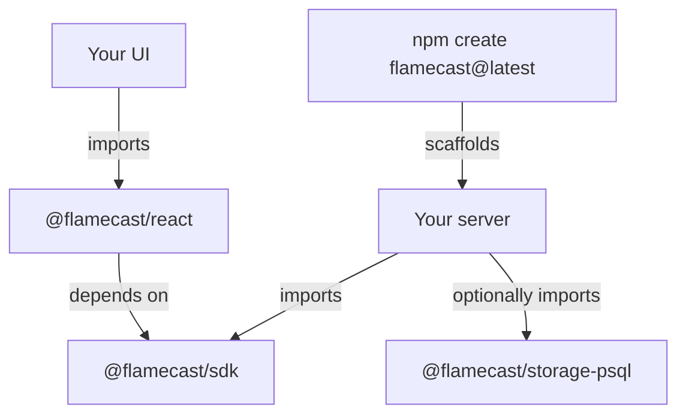

Flamecast is designed around two core ideas: **reasonable defaults** and **infinite configurability**. You should be able to get started in seconds, and you should never hit a wall when your needs grow.

## Reasonable defaults, infinite config

The reference server in `apps/server` is intentionally minimal. It creates a `Flamecast` instance with sensible defaults and calls `listen()`. That's it.

```typescript
import { Flamecast } from "@flamecast/sdk";
import { createPsqlStorage } from "@flamecast/storage-psql";

const flamecast = new Flamecast({
  storage: await createPsqlStorage(),
});
await flamecast.listen(3001);
```

This works out of the box with embedded PGLite storage, local process runtime, and built-in agent templates. But every piece is replaceable. Swap in Postgres storage, add a custom runtime provider, register your own templates, or use the `fetch` handler for serverless deployments.

The goal is that `apps/server` never needs to change. It exists as a starting point. All customization flows through the `Flamecast` constructor and the packages you choose to install.

```typescript
import { Flamecast } from "@flamecast/sdk";
import { createPsqlStorage } from "@flamecast/storage-psql";

const flamecast = new Flamecast({
  storage: await createPsqlStorage({ url: process.env.DATABASE_URL }),
  runtimes: {
    local: new LocalRuntime(),
    docker: new LocalDockerRuntime(),
    e2b: new E2BRuntime({ apiKey: process.env.E2B_API_KEY }),
  },
  agentTemplates: [
    {
      id: "my-agent",
      name: "My agent",
      spawn: { command: "node", args: ["agent.js"] },
      runtime: "e2b",
    },
  ],
});
```

If Flamecast doesn't expose a configuration option you need, that's a bug.

## Run anywhere

Flamecast adapts to your deployment model. The same `Flamecast` instance works in both stateful and stateless environments — you choose how to expose it.

**Stateful (long-running server)** — call `listen()`. This starts an HTTP + WebSocket server that manages agent processes, holds connections open, and persists state locally. Ideal for running on a VM, a VPS, or your own machine.

```typescript
const flamecast = new Flamecast({
  storage: await createPsqlStorage(),
});
await flamecast.listen(3001);
```

**Stateless (serverless / edge)** — export the `fetch` handler. This gives you a standard `Request → Response` function compatible with Cloudflare Workers, Vercel Edge Functions, or any runtime that supports the Web Fetch API.

```typescript
const flamecast = new Flamecast({
  storage: await createPsqlStorage({ url: process.env.DATABASE_URL }),
});

export default flamecast.fetch;
```

There's no framework lock-in. Flamecast doesn't care whether it runs on AWS, GCP, Cloudflare, Vercel, Fly.io, a Raspberry Pi, or a local dev server. It works with any agent that speaks ACP, deployed in any cloud, exposed through whichever entry point fits your infrastructure.

## Package split

Flamecast is a monorepo with focused, independently versioned packages. Each package has one job.

### Current packages

| Package | Purpose |
|---|---|
| `@flamecast/sdk` | Core SDK. The `Flamecast` class, REST API, WebSocket server, runtime providers, and the `FlamecastStorage` interface |
| `@flamecast/storage-psql` | Postgres and PGLite storage adapter implementing `FlamecastStorage` |

### Planned packages

| Package | Purpose |
|---|---|
| `create-flamecast` | Scaffolding CLI. Run `npm create flamecast@latest` to generate a project identical to `apps/server` — a ready-to-run Flamecast server you own and can customize |
| `@flamecast/react` | React hooks for building agent UIs. Currently these live inside `@flamecast/sdk` and will be extracted into their own package so you can use the API SDK without pulling in React |

The split follows a principle: **you should only install what you use**. A headless backend that orchestrates agents should not need React. A frontend that renders agent output should not need Postgres. The scaffolding CLI gives you a starting point without coupling you to the monorepo.

### How the pieces fit together



`@flamecast/sdk` is always the foundation. Storage adapters and React hooks are optional layers. The scaffolding CLI creates a server project that imports the SDK and any adapters you choose — from there, it's your code to modify however you want.
