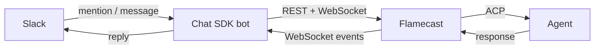
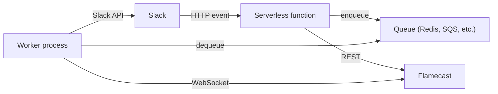

[Chat SDK](https://chat-sdk.dev) is a TypeScript framework for building chatbots that work across Slack, Discord, Microsoft Teams, and other platforms. You can use it to give your Flamecast-managed agents a conversational Slack interface.

## Architecture

The Slackbot acts as a bridge between Slack and Flamecast. When a user mentions the bot, it creates a Flamecast agent session and forwards messages back and forth.



<Warning>
  Flamecast currently requires a **persistent WebSocket connection** to receive session events. This means the bot process must stay running for the duration of the agent session. This works well on long-lived servers (VMs, containers, always-on processes) but is not compatible with stateless/serverless platforms like Vercel Functions or AWS Lambda where execution is short-lived.

  See [Stateless deployments](#stateless-deployments) below for workarounds and the planned solution.
</Warning>

## Set up the project

```bash
mkdir my-slackbot && cd my-slackbot
npm init -y
npm install chat-sdk @flamecast/sdk
```

## Write the bot

```typescript
import { Chat, createSlackAdapter } from "chat-sdk";
import { createFlamecastClient } from "@flamecast/sdk/client";
import { FlamecastSession } from "@flamecast/sdk/client/lib/flamecast-session";

const flamecast = createFlamecastClient({
  baseUrl: process.env.FLAMECAST_URL || "http://localhost:3001",
});

// Track active sessions per Slack thread
const threadSessions = new Map<string, FlamecastSession>();

const bot = new Chat({
  userName: "my-agent",
  adapters: {
    slack: createSlackAdapter(),
  },
});

bot.onNewMention(async (thread) => {
  // Create a new Flamecast session for this thread
  const agent = await flamecast.createSession({
    agentTemplateId: "codex",
  });

  const session = new FlamecastSession({
    websocketUrl: agent.websocketUrl!,
    sessionId: agent.id,
  });

  session.connect();
  threadSessions.set(thread.id, session);

  // Stream agent responses back to Slack
  let buffer = "";
  session.on((event) => {
    if (event.data?.sessionUpdate === "agent_message_chunk") {
      buffer += event.data.content?.text || "";
    }
    // When the agent finishes its turn, post the full response
    if (event.data?.phase === "response") {
      if (buffer) {
        thread.post(buffer);
        buffer = "";
      }
    }
  });

  // Send the initial mention text as a prompt
  const mentionText = thread.messages[0]?.text || "";
  session.prompt(mentionText);
});

bot.onReply(async (thread) => {
  const session = threadSessions.get(thread.id);
  if (!session) return;

  // Forward the reply as a new prompt
  const latestMessage = thread.messages[thread.messages.length - 1];
  session.prompt(latestMessage?.text || "");
});
```

## Handle permission requests

When the agent requests permission for a sensitive operation, post a message to Slack and wait for the user to reply:

```typescript
session.on((event) => {
  if (event.type === "permission_request") {
    const permission = event.data;
    thread.post(
      `Agent wants to: **${permission.title}**\n` +
      `Reply "allow" to approve or "deny" to reject.`
    );
  }
});

bot.onReply(async (thread) => {
  const session = threadSessions.get(thread.id);
  if (!session) return;

  const text = thread.messages[thread.messages.length - 1]?.text?.toLowerCase();

  // Check if this is a permission response
  if (text === "allow" || text === "deny") {
    const permissionEvent = session.events
      .filter((e) => e.type === "permission_request")
      .pop();

    if (permissionEvent) {
      const requestId = permissionEvent.data.requestId;
      if (text === "allow") {
        session.respondToPermission(requestId, { optionId: "allow" });
      } else {
        session.respondToPermission(requestId, { outcome: "cancelled" });
      }
      return;
    }
  }

  // Otherwise treat it as a regular prompt
  session.prompt(text || "");
});
```

## Run the bot

Make sure Flamecast is running, then start the bot:

```bash
# Terminal 1: Start Flamecast
cd my-flamecast-app
pnpm dev

# Terminal 2: Start the Slackbot
cd my-slackbot
npx tsx bot.ts
```

## Clean up sessions

Terminate agent sessions when a Slack thread goes stale or the bot is shut down:

```typescript
// On thread inactivity or bot shutdown
for (const [threadId, session] of threadSessions) {
  session.terminate();
  session.disconnect();
  threadSessions.delete(threadId);
}
```

## Stateless deployments

If you want to run the bot on a stateless platform (Vercel, AWS Lambda, Cloudflare Workers), the persistent WebSocket requirement is a problem. Agent sessions can run for minutes or hours, far longer than a serverless function's execution limit.

### Current workaround: separate long-lived worker

Run the WebSocket listener as a separate long-lived process and communicate with it from your serverless function:



1. The serverless function receives Slack events, creates sessions via `POST /api/agents`, and enqueues prompts.
2. A long-lived worker process picks up prompts, maintains WebSocket connections to Flamecast, and posts agent responses back to Slack via the Slack API.

### Planned: webhook event delivery

Flamecast will support webhook-based event delivery, where events are POSTed to a callback URL instead of streamed over WebSocket. This will enable fully stateless integrations — your serverless function registers a webhook URL when creating a session, and Flamecast delivers events to it as they happen.

<Card title="RFC: Webhook event delivery" icon="webhook" href="/rfcs/webhooks" horizontal>
  Read the full design proposal, including the stateless Slackbot example.
</Card>

## Other platforms

Chat SDK supports Discord, Microsoft Teams, Google Chat, GitHub, and Linear. The same pattern applies — swap `createSlackAdapter()` for the adapter you need:

```typescript
import { createDiscordAdapter } from "chat-sdk";

const bot = new Chat({
  userName: "my-agent",
  adapters: {
    discord: createDiscordAdapter(),
  },
});
```

See the [Chat SDK documentation](https://chat-sdk.dev) for platform-specific setup and configuration.
