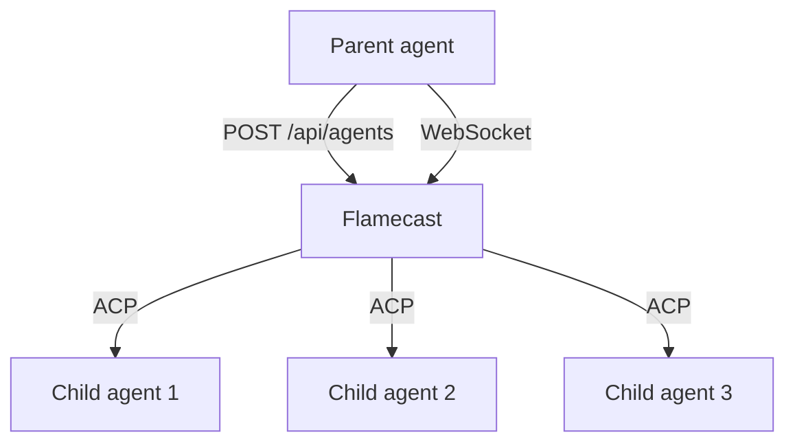

A common pattern is a parent agent that delegates subtasks to specialized child agents. Flamecast's REST API makes this straightforward — your parent agent creates and manages child sessions through the same API that any other client uses.

## How it works

Your parent agent calls the Flamecast REST API to spawn child agent sessions, sends them prompts, and collects their results. Each child runs as an independent ACP session with its own WebSocket stream.



## Example: parent agent with subagents

The parent agent is itself an ACP agent managed by Flamecast. When it receives a prompt, it breaks the work into subtasks and delegates each to a child agent.

### Parent agent

```typescript
import * as acp from "@agentclientprotocol/sdk";

const FLAMECAST_URL = "http://localhost:3001";

class ParentAgent implements acp.Agent {
  private connection: acp.AgentSideConnection;

  constructor(connection: acp.AgentSideConnection) {
    this.connection = connection;
  }

  async initialize(params) {
    return { protocolVersion: params.protocolVersion, agentCapabilities: {} };
  }

  async newSession(params) {
    return { sessionId: crypto.randomUUID() };
  }

  async prompt(params: acp.PromptParams): Promise<acp.PromptResponse> {
    this.connection.sessionUpdate({
      sessionId: params.sessionId,
      sessionUpdate: "agent_message_chunk",
      content: { type: "text", text: "Delegating to child agents...\n" },
    });

    // Spawn two child sessions on different working directories
    const [child1, child2] = await Promise.all([
      this.spawnChild("codex", "/path/to/frontend"),
      this.spawnChild("codex", "/path/to/backend"),
    ]);

    // Send prompts to each child
    await Promise.all([
      this.promptChild(child1, "Fix the CSS layout bug in the header"),
      this.promptChild(child2, "Add input validation to the /users endpoint"),
    ]);

    this.connection.sessionUpdate({
      sessionId: params.sessionId,
      sessionUpdate: "agent_message_chunk",
      content: { type: "text", text: "Both tasks completed." },
    });

    return { stopReason: "end_turn" };
  }

  async cancel() {}

  private async spawnChild(templateId: string, cwd: string) {
    const res = await fetch(`${FLAMECAST_URL}/api/agents`, {
      method: "POST",
      headers: { "Content-Type": "application/json" },
      body: JSON.stringify({ agentTemplateId: templateId, cwd }),
    });
    return res.json();
  }

  private async promptChild(session: any, text: string) {
    return new Promise<void>((resolve) => {
      const ws = new WebSocket(session.websocketUrl);

      ws.onopen = () => {
        ws.send(JSON.stringify({ action: "prompt", text }));
      };

      ws.onmessage = (event) => {
        const msg = JSON.parse(event.data);
        if (msg.type === "event" && msg.event?.data?.phase === "response") {
          ws.close();
          resolve();
        }
      };
    });
  }
}
```

### Register the parent and children

```typescript
import { Flamecast, NodeRuntime, listen } from "@flamecast/sdk";
import { createPsqlDatabase } from "@flamecast/storage-psql";

const flamecast = new Flamecast({
  backend: createPsqlDatabase(),
  runtimes: {
    default: new NodeRuntime(),
  },
  agentTemplates: [
    {
      id: "orchestrator",
      name: "Orchestrator",
      spawn: { command: "node", args: ["parent-agent.js"] },
      runtime: "default",
    },
    {
      id: "codex",
      name: "Codex",
      spawn: { command: "pnpm", args: ["dlx", "@zed-industries/codex-acp"] },
      runtime: "default",
    },
  ],
});

await flamecast.init();
listen(flamecast, 3001);
```

Now start the orchestrator:

```bash
curl -X POST http://localhost:3001/api/agents \
  -H "Content-Type: application/json" \
  -d '{ "agentTemplateId": "orchestrator" }'
```

## Using the Client SDK

For a cleaner integration, use the Flamecast Client SDK instead of raw `fetch` and `WebSocket` calls:

```typescript
import { createFlamecastClient } from "@flamecast/sdk/client";
import { FlamecastSession } from "@flamecast/sdk/client/lib/flamecast-session";

const client = createFlamecastClient({ baseUrl: "http://localhost:3001" });

// Spawn a child
const child = await client.createSession({ agentTemplateId: "codex" });

// Connect and prompt
const session = new FlamecastSession({
  websocketUrl: child.websocketUrl!,
  sessionId: child.id,
});

session.connect();
session.prompt("Fix the bug in auth.ts");

// Listen for completion
session.on((event) => {
  if (event.data?.phase === "response") {
    session.disconnect();
  }
});
```

## Managing child lifecycle

Terminate child agents when they're no longer needed:

```typescript
// Via REST
await fetch(`${FLAMECAST_URL}/api/agents/${child.id}`, { method: "DELETE" });

// Via SDK
await client.terminateSession(child.id);

// Via WebSocket
session.terminate();
```

Flamecast tracks all sessions — both parent and child — in its storage backend. Use `GET /api/agents` to list all active sessions.
