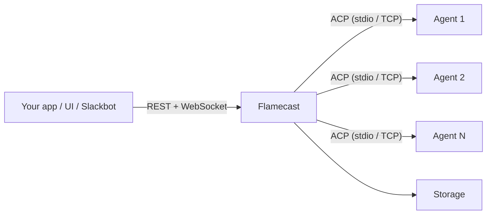

Flamecast manages agent sessions behind a REST API, brokers permission requests, persists session metadata and logs, and streams everything in real time over WebSocket. It works with any agent that speaks the [Agent Client Protocol](https://agentclientprotocol.com).

## What can you do with Flamecast?

<CardGroup cols={2}>
  <Card title="Orchestrate local agents" icon="terminal" href="/guides/local-agents">
    Run Claude Code, Codex, or other ACP agents as local child processes.
  </Card>
  <Card title="Orchestrate cloud agents" icon="cloud" href="/guides/cloud-agents">
    Connect to agents running in Docker, Kubernetes, or remote servers.
  </Card>
  <Card title="Build your own agent" icon="hammer" href="/guides/build-your-own-agent">
    Make your agent ACP-compatible and get a REST + WebSocket API for free.
  </Card>
  <Card title="Spin off subagents" icon="diagram-project" href="/guides/subagents">
    Use Flamecast to spawn and coordinate multiple agents from a parent agent.
  </Card>
  <Card title="Set up a Slackbot" icon="message" href="/guides/slackbot">
    Connect an agent to Slack using Chat SDK for a conversational interface.
  </Card>
  <Card title="Build a custom UI" icon="browser" href="/guides/custom-ui">
    Use the React hooks and Client SDK to build your own agent interface.
  </Card>
</CardGroup>

## How it works

Flamecast sits between your agents and the clients that interact with them:

1. You tell Flamecast to start an agent session (via REST API or SDK).
2. Flamecast spawns the agent using a [runtime provider](/guides/architecture) (local process, Docker container, or custom).
3. Flamecast brokers all communication over ACP — prompts, responses, tool calls, and permission requests.
4. Clients connect over WebSocket for real-time streaming, or poll the REST API.

<Card title="Quickstart" icon="rocket" href="/quickstart" horizontal>
  Install Flamecast and launch your first agent session in under a minute.
</Card>
