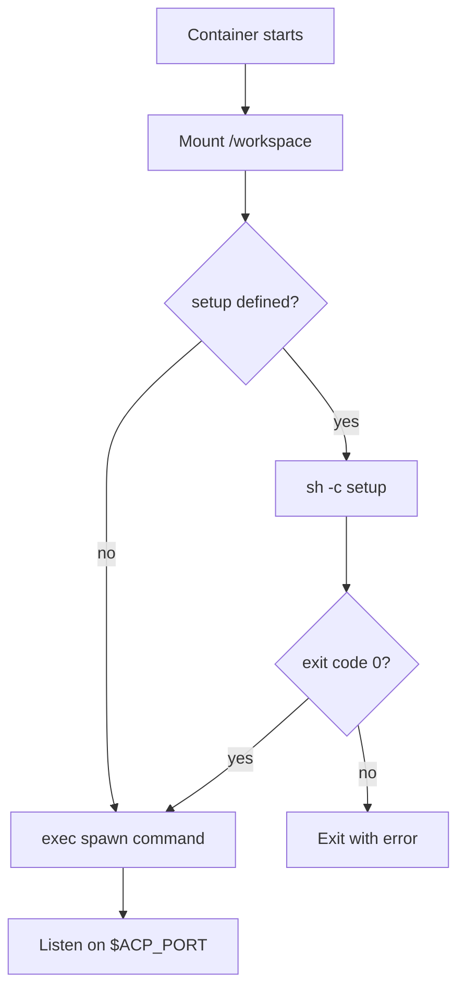

<Info>
  This is a design proposal, not a shipped feature. Feedback is welcome on [GitHub](https://github.com/anthropics/flamecast).
</Info>

## Problem

Today, running an agent in a Docker container requires writing a Dockerfile from scratch. Even for common patterns — a TypeScript agent or a Python agent — users need to set up Node.js or Python, install dependencies, configure the ACP port, and wire up the entry point. This boilerplate is nearly identical across projects and creates unnecessary friction for getting started.

## Proposed solution: pre-built base images

Flamecast publishes a set of pre-built Docker images for common agent patterns. These images come with the language runtime, ACP SDK, and a standard entrypoint pre-configured. Users provide their agent code and a `setup` script to install dependencies — no Dockerfile needed.

### Available images

| Image | Base | Included |
|---|---|---|
| `ghcr.io/anthropics/flamecast/node` | `node:22-slim` | Node.js 22, `@agentclientprotocol/sdk`, ACP TCP entrypoint |
| `ghcr.io/anthropics/flamecast/python` | `python:3.12-slim` | Python 3.12, `acp-sdk`, ACP TCP entrypoint |
| `ghcr.io/anthropics/flamecast/base` | `ubuntu:24.04` | Minimal base with ACP TCP entrypoint only |

Each image includes an entrypoint that:

1. Waits for the `setup` script to complete (if provided)
2. Starts the agent process defined by `spawn`
3. Listens for ACP connections on `$ACP_PORT`

### Usage with `LocalDockerRuntime`

Instead of writing a Dockerfile, reference a pre-built image on the runtime:

```typescript
const flamecast = new Flamecast({
  runtimes: {
    node: new LocalDockerRuntime({
      image: "ghcr.io/anthropics/flamecast/node",
    }),
    python: new LocalDockerRuntime({
      image: "ghcr.io/anthropics/flamecast/python",
    }),
  },
  agentTemplates: [
    {
      id: "ts-agent",
      name: "TypeScript agent",
      spawn: { command: "node", args: ["agent.js"] },
      setup: "npm install",
      runtime: "node",
    },
    {
      id: "py-agent",
      name: "Python agent",
      spawn: { command: "python", args: ["agent.py"] },
      setup: "pip install -r requirements.txt",
      runtime: "python",
    },
  ],
});
```

With pre-built images, the `spawn` field is respected (unlike custom Dockerfiles where `CMD` takes precedence). The image's entrypoint delegates to whatever `spawn` defines.

### REST API registration

```bash
curl -X POST http://localhost:3001/api/agent-templates \
  -H "Content-Type: application/json" \
  -d '{
    "name": "Python agent",
    "spawn": { "command": "python", "args": ["agent.py"] },
    "setup": "pip install -r requirements.txt",
    "runtime": "python"
  }'
```

## Image design

### Entrypoint lifecycle

Pre-built images use a Flamecast-managed entrypoint that coordinates setup and spawn:



This solves the `CMD` vs `setup` race condition described in the [Dockerfile validation RFC](/rfcs/dockerfile-validation). Because the entrypoint is controlled by Flamecast, setup always runs before the agent starts.

### Volume mounts

The host working directory is mounted at `/workspace` inside the container. The setup script and agent process both run with `/workspace` as their working directory.

### Environment variables

All pre-built images forward these environment variables to both setup and spawn:

| Variable | Description |
|---|---|
| `ACP_PORT` | Port the agent should listen on for ACP connections |
| `WORKSPACE` | Path to the mounted workspace (`/workspace`) |

Additional environment variables can be configured on the runtime:

```typescript
new LocalDockerRuntime({
  image: "ghcr.io/anthropics/flamecast/node",
  env: {
    ANTHROPIC_API_KEY: process.env.ANTHROPIC_API_KEY,
    NODE_ENV: "production",
  },
})
```

## Examples

### TypeScript agent with build step

```typescript
{
  id: "ts-agent",
  name: "TypeScript agent",
  spawn: { command: "node", args: ["dist/agent.js"] },
  setup: "npm install && npm run build",
  runtime: "node",
}
```

### Python agent with virtual environment

```typescript
{
  id: "py-agent",
  name: "Python agent",
  spawn: { command: "python", args: ["agent.py"] },
  setup: `
    python -m venv /tmp/venv
    . /tmp/venv/bin/activate
    pip install -r requirements.txt
  `,
  runtime: "python",
}
```

### Minimal base image with custom tooling

For agents that need system packages or non-standard runtimes, use the `base` image and install everything in setup:

```typescript
{
  id: "rust-agent",
  name: "Rust agent",
  spawn: { command: "./target/release/agent" },
  setup: `
    apt-get update && apt-get install -y build-essential
    curl --proto '=https' --tlsv1.2 -sSf https://sh.rustup.rs | sh -s -- -y
    . "$HOME/.cargo/env"
    cargo build --release
  `,
  runtime: "base",
}
```

## Relationship to custom Dockerfiles

Pre-built images are a convenience — they don't replace custom Dockerfiles. The tradeoffs:

| | Pre-built images | Custom Dockerfile |
|---|---|---|
| **Setup** | No Dockerfile needed. Reference an image and provide `setup` | Write and maintain a Dockerfile |
| **`spawn` field** | Respected. The entrypoint delegates to `spawn` | Ignored. Docker `CMD` takes precedence |
| **`setup` ordering** | Guaranteed to run before spawn | Runs alongside `CMD` (race condition — see [Dockerfile validation RFC](/rfcs/dockerfile-validation)) |
| **Flexibility** | Limited to what the base image provides + `setup` installs | Full control over the image |
| **Build time** | No image build. Pull once, reuse across sessions | Image build on first use (cached after) |
| **Image size** | General-purpose, potentially larger than needed | Can be optimized for your specific agent |

For most agents, pre-built images are the recommended path. Use a custom Dockerfile when you need precise control over the image contents or want to minimize image size for production deployments.

## `image` option on `LocalDockerRuntime`

The `image` field on `LocalDockerRuntime` tells the runtime to use a pre-built image instead of building from a Dockerfile:

```typescript
interface LocalDockerRuntimeOptions {
  image?: string;           // Pre-built image to use (e.g. "ghcr.io/anthropics/flamecast/node")
  dockerfile?: string;      // Path to Dockerfile (mutually exclusive with image)
  env?: Record<string, string>;  // Environment variables forwarded to the container
}
```

If neither `image` nor `dockerfile` is provided, the runtime looks for a `Dockerfile` in the working directory (current behavior).

## Open questions

1. **Version pinning.** Should images be tagged with Flamecast versions (e.g. `flamecast/node:0.5.0`) or use `latest`? Version-pinned tags are more predictable but require users to update when upgrading Flamecast.

2. **Caching setup results.** Pre-built images run `setup` on every session start. Should Flamecast support snapshotting the container state after setup to skip it on subsequent sessions with the same template?

3. **GPU support.** Should there be a `flamecast/python-cuda` image for ML agents that need GPU access? This requires NVIDIA container toolkit integration on the host.

4. **Image registry.** Should Flamecast support pulling from private registries? If so, how should registry credentials be configured on the runtime?
