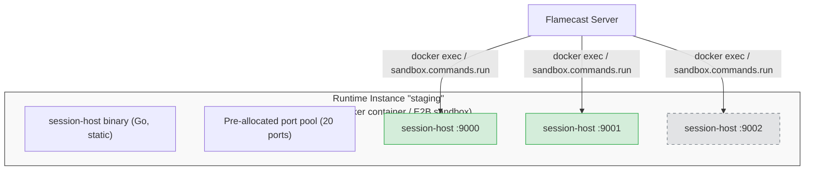
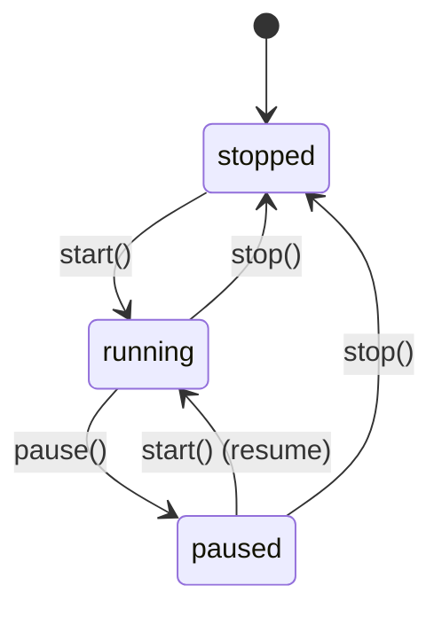

<Info>
  This RFC reflects the current implementation on the `feat/runtime-lifecycle` branch.
</Info>

## Background

The Flamecast constructor accepts a `runtimes` map that registers execution environments:

```typescript
const fc = new Flamecast({
  runtimes: {
    default: new NodeRuntime(),
    docker: new DockerRuntime(),
    e2b: new E2BRuntime({ apiKey: process.env.E2B_API_KEY }),
  },
});
```

Runtimes handle session lifecycle — starting agent processes, routing HTTP/WS traffic, and tearing down containers or sandboxes. Previously they were passive: always-on, invisible to the UI, and limited to a single logical instance per registered name.

## Problem

1. **No lifecycle management.** Runtimes were always-on with no start/stop semantics. You couldn't spin up a Docker environment on demand or shut one down to reclaim resources.

2. **No UI visibility.** The dashboard showed sessions and templates, but had no concept of runtimes. Operators couldn't see which runtimes were available, which were running, or what sessions belonged to which runtime.

3. **Single instance per type.** Each registered name mapped to exactly one runtime object. You couldn't run multiple Docker environments (e.g., `staging` and `prod`) from the same `DockerRuntime`.

4. **No session scoping.** Sessions didn't track which runtime instance they belonged to. There was no way to filter the UI to "show me only the sessions running on staging".

## Solution

### Architecture: container/sandbox-per-instance

Multi-instance runtimes (Docker, E2B) follow a **container-per-instance** model:

- **`start(instanceId)`** creates a long-lived container (Docker) or sandbox (E2B) with pre-allocated ports and the session-host Go binary.
- **Sessions** are processes *inside* that container/sandbox, started via `docker exec` or `sandbox.commands.run()`.
- **`pause(instanceId)`** freezes the container/sandbox, suspending all sessions without terminating them.
- **`stop(instanceId)`** kills the container/sandbox entirely.





### Runtime interface

```typescript
export interface Runtime<TConfig extends Record<string, unknown> = {}> {
  /** If true, only a single instance is allowed (e.g., NodeRuntime). Default: false. */
  readonly onlyOne?: boolean;

  fetchSession(sessionId: string, request: Request): Promise<Response>;

  /** Start (or resume) a runtime instance. Creates it if it doesn't exist. */
  start?(instanceId: string): Promise<void>;

  /** Stop a specific runtime instance and tear down its resources. */
  stop?(instanceId: string): Promise<void>;

  /** Pause a runtime instance (sessions survive, resources freeze). */
  pause?(instanceId: string): Promise<void>;

  /** Query the live status of an instance from the actual runtime. */
  getInstanceStatus?(instanceId: string): Promise<"running" | "stopped" | "paused" | undefined>;

  /** Return runtime-specific metadata for session recovery after server restart. */
  getRuntimeMeta?(sessionId: string): Record<string, unknown> | null;

  /** Re-register a previously-running session after a server restart. */
  reconnect?(sessionId: string, runtimeMeta: Record<string, unknown> | null): Promise<boolean>;

  dispose?(): Promise<void>;
}
```

### Instance model

| Runtime type | `onlyOne` | Instance naming | Behavior |
|---|---|---|---|
| `NodeRuntime` | `true` | Instance name = type name (e.g., `"default"`) | Lifecycle methods are no-ops. One implicit instance. |
| `DockerRuntime` | `false` | User-provided (e.g., `"staging"`) | Creates a Docker container per instance. Sessions are `docker exec` processes inside. |
| `E2BRuntime` | `false` | User-provided (e.g., `"e2b-1"`) | Creates an E2B sandbox per instance. Uploads the Go session-host binary. Sessions are processes inside the sandbox. |

### Instance status

Each instance has a status that is **queried live** from the runtime (Docker API, E2B API), not just read from the database:

| Status | Meaning |
|---|---|
| `running` | Instance is active and can accept sessions |
| `paused` | Instance is frozen (Docker: paused container, E2B: paused sandbox). Sessions survive but are suspended. |
| `stopped` | Instance has been stopped or is no longer reachable |

`listRuntimes()` calls `runtime.getInstanceStatus()` for each persisted instance and syncs the DB if the live status has drifted (e.g., someone paused via Docker Desktop). If the runtime returns `undefined` for a "running" instance (e.g., after server restart where in-memory state is lost), it's automatically marked as "stopped".

### DockerRuntime internals

- Creates a container with `tail -f /dev/null` as the entrypoint (keeps it alive)
- Bind-mounts the session-host Go binary as read-only
- Pre-allocates a port range (default: 20 ports starting at 9000) with ephemeral host port mapping
- `handleStart()` reads `instanceName` from the request body, allocates a port, and runs `docker exec` with the session-host binary
- `pause()` calls `container.pause()`, `start()` on a paused instance calls `container.unpause()`
- `getInstanceStatus()` inspects the actual Docker container state

### E2BRuntime internals

- Creates a sandbox from the `"base"` template (or configurable)
- Uploads the session-host Go binary via `sandbox.files.write()` (always uses the **amd64** binary since E2B sandboxes are x86_64)
- Pre-allocates a port pool (default: 20 ports starting at 9000)
- `handleStart()` runs the binary via `sandbox.commands.run()` in background
- Uses `sandbox.getHost(port)` for HTTPS port forwarding (no host port binding needed)
- `pause()` calls `Sandbox.pause()`, `start()` on a paused instance uses `Sandbox.connect()` which auto-resumes
- `getInstanceStatus()` uses `Sandbox.getFullInfo()` to query sandbox state

**Cross-compilation:** The session-host Go binary is built for both `linux/amd64` and `linux/arm64`. DockerRuntime uses the host architecture binary; E2BRuntime always uses `amd64`.

### Flamecast lifecycle API

```typescript
class Flamecast {
  /** Start a runtime instance. For onlyOne types, instanceName defaults to typeName. */
  async startRuntime(typeName: string, instanceName?: string): Promise<RuntimeInstance>;

  /** Stop a runtime instance. Terminates all active sessions on it first. */
  async stopRuntime(instanceName: string): Promise<void>;

  /** Pause a runtime instance (if the runtime supports it). */
  async pauseRuntime(instanceName: string): Promise<void>;

  /** List all runtime types with their instances and live statuses. */
  async listRuntimes(): Promise<RuntimeInfo[]>;
}
```

Types:

```typescript
interface RuntimeInstance {
  name: string;
  typeName: string;
  status: "running" | "stopped" | "paused";
}

interface RuntimeInfo {
  typeName: string;
  onlyOne: boolean;
  instances: RuntimeInstance[];
}
```

### Session scoping

Sessions have a `runtime` field recording which runtime instance they belong to. The `instanceName` is passed in the `/start` request body from the `SessionService` so the runtime knows which container/sandbox to exec into.

```typescript
interface Session {
  // ... existing fields ...
  runtime?: string;  // runtime instance name
}
```

When creating a session, the client can specify `runtimeInstance` to target a specific instance:

```typescript
await flamecast.createSession({
  agentTemplateId: "docker-agent",
  runtimeInstance: "staging",
});
```

### Persistence

Runtime instance state is persisted via the storage interface.

**Storage additions:**

```typescript
interface FlamecastStorage {
  saveRuntimeInstance(instance: RuntimeInstance): Promise<void>;
  listRuntimeInstances(): Promise<RuntimeInstance[]>;
  deleteRuntimeInstance(name: string): Promise<void>;
}
```

**Postgres schema:**

```sql
CREATE TABLE flamecast.runtime_instances (
  name       TEXT PRIMARY KEY,
  type_name  TEXT NOT NULL,
  status     TEXT NOT NULL DEFAULT 'running'
);
```

### REST API

| Method | Path | Description |
|---|---|---|
| `GET` | `/api/runtimes` | List runtime types with instances and live statuses |
| `POST` | `/api/runtimes/:typeName/start` | Start an instance. Body: `{ name?: string }` |
| `POST` | `/api/runtimes/:instanceName/stop` | Stop an instance (terminates sessions first) |
| `POST` | `/api/runtimes/:instanceName/pause` | Pause an instance |

**`GET /api/runtimes` response:**

```json
[
  {
    "typeName": "default",
    "onlyOne": true,
    "instances": []
  },
  {
    "typeName": "docker",
    "onlyOne": false,
    "instances": [
      { "name": "staging", "typeName": "docker", "status": "running" },
      { "name": "prod", "typeName": "docker", "status": "paused" }
    ]
  },
  {
    "typeName": "e2b",
    "onlyOne": false,
    "instances": [
      { "name": "e2b-1", "typeName": "e2b", "status": "running" }
    ]
  }
]
```

### Client SDK

```typescript
interface FlamecastClient {
  fetchRuntimes(): Promise<RuntimeInfo[]>;
  startRuntime(typeName: string, name?: string): Promise<RuntimeInstance>;
  stopRuntime(instanceName: string): Promise<void>;
  pauseRuntime(instanceName: string): Promise<void>;
}
```

### UI

The sidebar has a **Runtimes** group above the sessions list:

- **`onlyOne` types** (e.g., `default`): clickable label that filters sessions, no lifecycle controls
- **Multi-instance types** (e.g., `docker`, `e2b`): "+" button to create a named instance
  - **Running instances**: pause (⏸) and stop (⏹) buttons on hover
  - **Paused instances**: yellow badge + play (▶) button to resume
  - **Stopped instances**: gray badge + play (▶) button to restart
  - **Loading states**: spinner replaces icon during in-flight actions
  - **Error handling**: toast notifications via Sonner on action failures
- **Clicking an instance** filters sessions and templates to that runtime
- **`?runtime=X`** URL parameter for deep linking

**Session creation** on the templates page:

- Multi-instance templates show a runtime instance dropdown (only running instances)
- "Start session" button shows a spinner while creating
- Toast error on creation failure with the actual error message

### Server restart recovery

After a server restart:

1. **Runtime instances**: `listRuntimes()` queries live status via `getInstanceStatus()`. If the runtime has no in-memory state for a "running" instance (lost on restart), it's automatically marked "stopped" in the DB.
2. **Sessions**: `recoverSessions()` attempts to reconnect to still-running session-hosts via `runtime.reconnect()`, which checks process health and re-registers the session in the runtime's internal maps.

## Resolved questions

1. **Session cleanup on stop.** All active sessions on the instance are terminated before calling `runtime.stop()`.

2. **Per-instance config.** All instances share the config from the constructor. Per-instance config is not supported yet.

3. **Routing for multi-instance runtimes.** A single runtime object per type manages all instances internally. The `instanceName` is passed through the `/start` request body so the runtime knows which container/sandbox to target. `fetchSession()` routes based on the runtime's internal session→instance mapping.

4. **Architecture mismatch.** The session-host Go binary is cross-compiled for both amd64 and arm64. Each runtime resolves the appropriate binary for its target platform.
