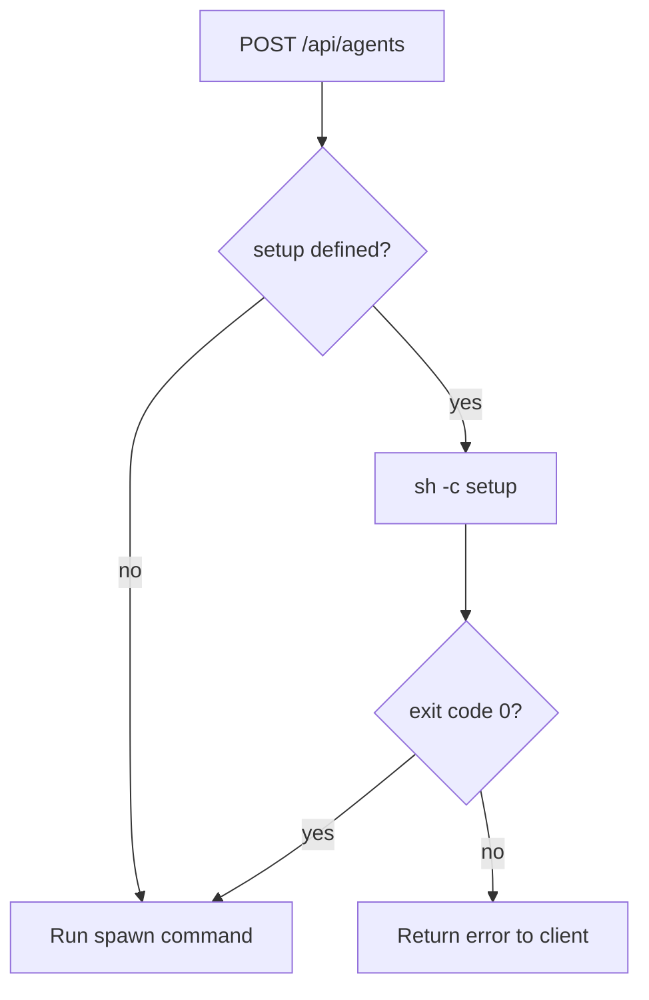

<Info>
  This is a design proposal, not a shipped feature. Feedback is welcome on [GitHub](https://github.com/anthropics/flamecast).
</Info>

## Problem

Agent templates currently define a `spawn` command that starts the agent process. But many agents need preparation before they can run — installing dependencies, compiling code, creating a git worktree, or initializing a workspace. Today, users work around this by baking everything into a Dockerfile or writing wrapper scripts, which adds complexity and slows down iteration.

## Proposed solution: `setup` field on agent templates

Add an optional `setup` string to the agent template interface. The string is executed as a shell script (`sh -c`) and runs to completion before the agent process starts.

### Interface

```typescript
interface AgentTemplate {
  id: string;
  name: string;
  spawn: { command: string; args?: string[] };
  setup?: string;
  runtime: string;
}
```

The `setup` field is a plain string — not a command/args object. This keeps it simple for multi-step preparation where you'd naturally chain commands with `&&`, use variables, or write multi-line scripts.

### Template definition

```typescript
const flamecast = new Flamecast({
  runtimes: {
    local: new LocalRuntime(),
  },
  agentTemplates: [
    {
      id: "my-agent",
      name: "My agent",
      spawn: { command: "node", args: ["agent.js"] },
      setup: "npm install && npm run build",
      runtime: "local",
    },
  ],
});
```

### REST API registration

```bash
curl -X POST http://localhost:3001/api/agent-templates \
  -H "Content-Type: application/json" \
  -d '{
    "name": "My agent",
    "spawn": { "command": "node", "args": ["agent.js"] },
    "setup": "npm install && npm run build",
    "runtime": "local"
  }'
```

## Examples

### Install dependencies

```typescript
{
  id: "my-agent",
  name: "My agent",
  spawn: { command: "node", args: ["agent.js"] },
  setup: "npm install",
  runtime: "local",
}
```

### Git worktree isolation

Create an isolated worktree per session so each agent works on its own branch without touching the main checkout:

```typescript
{
  id: "codex-worktree",
  name: "Codex (worktree)",
  spawn: { command: "pnpm", args: ["dlx", "@zed-industries/codex-acp"] },
  setup: `
    BRANCH="agent-$(date +%s)-$$"
    git worktree add -b "$BRANCH" "/tmp/worktrees/$BRANCH" HEAD
    cd "/tmp/worktrees/$BRANCH"
    npm install
  `,
  runtime: "local",
}
```

### Python virtual environment

```typescript
{
  id: "python-agent",
  name: "Python agent",
  spawn: { command: "python", args: ["agent.py"] },
  setup: `
    python -m venv .venv
    . .venv/bin/activate
    pip install -r requirements.txt
  `,
  runtime: "local",
}
```

### Docker with per-session setup

When the Dockerfile defines a general-purpose base image, use `setup` for per-session preparation:

```typescript
{
  id: "ml-agent",
  name: "ML agent",
  spawn: { command: "python", args: ["agent.py"] },
  setup: "pip install -r requirements.txt && python download_model.py",
  runtime: "docker",
}
```

## Execution model

### Lifecycle

When a session is created via `POST /api/agents`:

1. The runtime allocates the environment (local process, Docker container, cloud sandbox, etc.)
2. If `setup` is defined, Flamecast runs `sh -c "<setup>"` in the session's working directory and waits for it to exit
3. If `setup` exits with code 0, Flamecast starts the `spawn` command
4. If `setup` exits with a non-zero code, the session fails and the error is returned to the client



### Runtime behavior

| Runtime | Where `setup` runs |
|---|---|
| `LocalRuntime` | On the host, in the session's working directory |
| `LocalDockerRuntime` | Inside the container, after start but before the agent process |
| Custom runtimes | Determined by the runtime's `start()` implementation |

### Environment

The setup script receives the same environment variables as the agent process, including:

- `ACP_PORT` (for TCP-based runtimes)
- Any environment variables configured on the runtime
- The session's working directory as `cwd`

### Stdout and stderr

Setup output is captured and included in the session logs. If setup fails, the output is included in the error response so the client can diagnose the issue.

## Timeout

Setup scripts have a default timeout of 5 minutes. If the script doesn't exit within the timeout, it's killed and the session fails.

*Proposed:* Allow a per-template timeout override via a `setupTimeout` field (in milliseconds):

```typescript
{
  id: "ml-agent",
  name: "ML agent",
  spawn: { command: "python", args: ["agent.py"] },
  setup: "pip install -r requirements.txt && python download_model.py",
  setupTimeout: 600_000, // 10 minutes for model download
  runtime: "docker",
}
```

## Open questions

1. **Caching.** Should Flamecast cache setup results across sessions that use the same template and working directory? For example, skip `npm install` if `node_modules` already exists and `package.json` hasn't changed.

2. **Streaming output.** Should setup script output be streamed to the client via WebSocket in real time, or only included in the final error response on failure?

3. **Working directory mutation.** If the setup script changes the working directory (e.g. `cd` into a worktree), should the `spawn` command inherit that new directory? This requires the setup script to communicate the new `cwd` back to Flamecast — for example, by writing it to a well-known file or printing a special marker to stdout.
