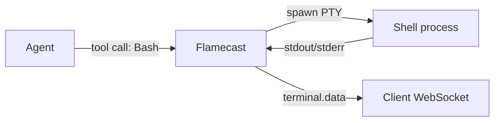

<Info>
  This is a design proposal, not a shipped feature. Feedback is welcome on [GitHub](https://github.com/anthropics/flamecast).
</Info>

## Problem

When an agent executes shell commands (tool calls like `Bash`, `exec`, or `run_command`), clients only see the final result — the tool call's return value after it completes. For long-running commands like `npm install`, `cargo build`, or test suites, there's no visibility into what's happening in real time:

- Users stare at a spinner with no feedback
- There's no way to see build errors as they happen
- Interactive debugging requires waiting for the full output
- Agents running multiple sequential commands feel unresponsive

## Proposed solution: terminal sessions over WebSocket

Expose the agent's terminal (PTY) output as a stream over the existing session WebSocket. Each shell command the agent runs gets a terminal session that clients can subscribe to for real-time output.

### How it works



1. When an agent executes a shell tool call, Flamecast spawns the command in a PTY (pseudo-terminal) instead of a plain subprocess
2. PTY output is streamed to all connected WebSocket clients as `terminal.data` messages
3. When the command exits, a `terminal.exit` message is sent with the exit code
4. The tool call result is still delivered as a normal `event` message

### WebSocket messages

New server-to-client messages:

| Type | Fields | Description |
|---|---|---|
| `terminal.started` | `terminalId`, `toolCallId`, `command` | A shell command started executing |
| `terminal.data` | `terminalId`, `data` | Raw terminal output (UTF-8 text, includes ANSI escape codes) |
| `terminal.exit` | `terminalId`, `exitCode` | The command exited |

```json
{
  "type": "terminal.started",
  "terminalId": "term-001",
  "toolCallId": "tc-abc",
  "command": "npm install"
}
```

```json
{
  "type": "terminal.data",
  "terminalId": "term-001",
  "data": "added 847 packages in 12s\n"
}
```

```json
{
  "type": "terminal.exit",
  "terminalId": "term-001",
  "exitCode": 0
}
```

New client-to-server actions:

| Action | Fields | Description |
|---|---|---|
| `terminal.input` | `terminalId`, `data` | Send input to a running terminal (for interactive commands) |
| `terminal.resize` | `terminalId`, `cols`, `rows` | Resize the PTY |

### Terminal output buffering

Terminal output is buffered per-terminal so clients that connect mid-command receive the history. The buffer has a configurable size limit (default: 100KB per terminal). When the buffer fills, the oldest output is discarded.

## React hook: `useTerminal`

```typescript
import { useTerminal } from "@flamecast/sdk/client/hooks/use-terminal";

function TerminalView({ sessionId }: { sessionId: string }) {
  const {
    terminals,      // TerminalSession[] — all terminals for this session
    activeTerminal, // TerminalSession | null — the most recently started terminal
  } = useTerminal(sessionId);

  return (
    <div>
      {terminals.map((term) => (
        <div key={term.terminalId}>
          <div className="terminal-header">
            {term.command} {term.exitCode !== null ? `(exit ${term.exitCode})` : "(running)"}
          </div>
          <pre className="terminal-output">{term.output}</pre>
        </div>
      ))}
    </div>
  );
}
```

### TerminalSession interface

```typescript
interface TerminalSession {
  terminalId: string;
  toolCallId: string;
  command: string;
  output: string;          // Accumulated terminal output
  exitCode: number | null; // null while running
  startedAt: string;
  endedAt: string | null;
}
```

### With xterm.js

For a full terminal experience with ANSI color support, cursor movement, and scrollback, use [xterm.js](https://xtermjs.org):

```typescript
import { useEffect, useRef } from "react";
import { Terminal } from "@xterm/xterm";
import { useTerminal } from "@flamecast/sdk/client/hooks/use-terminal";

function XTermView({ sessionId }: { sessionId: string }) {
  const termRef = useRef<HTMLDivElement>(null);
  const { activeTerminal, sendInput } = useTerminal(sessionId);

  useEffect(() => {
    if (!termRef.current || !activeTerminal) return;

    const xterm = new Terminal({ cols: 120, rows: 30 });
    xterm.open(termRef.current);

    // Write buffered output
    xterm.write(activeTerminal.output);

    // Subscribe to new output
    const unsub = activeTerminal.onData((data: string) => {
      xterm.write(data);
    });

    // Forward user input to the agent's terminal
    xterm.onData((data: string) => {
      sendInput(activeTerminal.terminalId, data);
    });

    return () => {
      unsub();
      xterm.dispose();
    };
  }, [activeTerminal?.terminalId]);

  return <div ref={termRef} />;
}
```

## REST API

### List terminal sessions

```
GET /api/agents/:agentId/terminals
```

**Response**

```json
{
  "terminals": [
    {
      "terminalId": "term-001",
      "toolCallId": "tc-abc",
      "command": "npm install",
      "exitCode": 0,
      "startedAt": "2025-03-24T10:30:00Z",
      "endedAt": "2025-03-24T10:30:12Z"
    },
    {
      "terminalId": "term-002",
      "toolCallId": "tc-def",
      "command": "npm test",
      "exitCode": null,
      "startedAt": "2025-03-24T10:30:15Z",
      "endedAt": null
    }
  ]
}
```

### Get terminal output

```
GET /api/agents/:agentId/terminals/:terminalId
```

Returns the buffered terminal output. Useful for fetching history without a WebSocket connection.

**Response**

```json
{
  "terminalId": "term-001",
  "command": "npm install",
  "output": "added 847 packages in 12s\n",
  "exitCode": 0
}
```

## Docker and remote runtimes

For `LocalDockerRuntime` and custom runtimes, terminal output is forwarded from the container or remote environment through the runtime bridge. The runtime's `start()` method can optionally return a `terminals` stream alongside the ACP transport:

```typescript
interface RuntimeStartResult {
  transport: AcpTransport;
  terminate: () => Promise<void>;
  events?: ReadableStream<SessionLog>;
  terminals?: ReadableStream<TerminalEvent>;  // New
}
```

If the runtime doesn't provide a `terminals` stream, Flamecast falls back to delivering tool call results without real-time output.

## Open questions

1. **Terminal persistence.** Should terminal output be persisted to storage, or is it ephemeral per session? Persisting allows viewing output after reconnecting, but increases storage usage.

2. **Output size limits.** What's the right default buffer size? 100KB per terminal? Should there be a per-session aggregate limit?

3. **Input security.** Allowing `terminal.input` from WebSocket clients means users can type into the agent's shell. Should this require a separate permission, or is it always allowed for connected clients?

4. **Concurrent terminals.** Should agents be able to run multiple commands in parallel, each with its own terminal? Or should terminals be strictly serial (one active at a time)?
