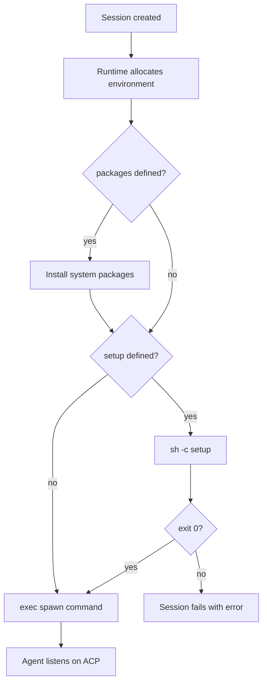

<Info>
  This is a design proposal, not a shipped feature. Feedback is welcome on [GitHub](https://github.com/anthropics/flamecast).
</Info>

## Problem

Today, local and Docker runtimes are fundamentally different authoring experiences. A `LocalRuntime` template uses `spawn` to start a process. A `LocalDockerRuntime` template requires a Dockerfile where `CMD` silently overrides `spawn`, `setup` races with the container entrypoint, and the template author must understand Docker semantics to get things right.

This creates three concrete problems:

1. **Templates aren't portable.** A template written for `LocalRuntime` won't work on `LocalDockerRuntime` without adding a Dockerfile. Moving from local development to containerized production means rewriting the template.

2. **Docker is load-bearing complexity.** Most agent authors want "install my dependencies, then run my script." Writing a Dockerfile for this is unnecessary friction — the existing [pre-built images RFC](/rfcs/prebuilt-images) addresses this, but there's no unified model that ties it together with local execution.

3. **Escape hatches are missing or awkward.** When a user _does_ need Docker-specific control (system packages, custom base images, multi-stage builds), they fall off the happy path entirely and lose `spawn`/`setup` semantics.

## Design principle: progressive disclosure

The runtime abstraction should follow progressive disclosure — simple things should be simple, complex things should be possible. Concretely:

| Complexity | What the user writes | What happens |
|---|---|---|
| **Zero config** | `setup` + `spawn` | Works identically on local and Docker. On Docker, uses a pre-built base image. No Dockerfile. |
| **Light config** | `setup` + `spawn` + `packages` | Same as above, but installs system packages before `setup` runs. Still no Dockerfile. |
| **Full control** | `dockerfile` on the runtime | User provides a Dockerfile. `spawn` is passed as the container command (not ignored). `setup` runs inside the container before `spawn`. |

Each layer is a superset of the previous one. A template that works at the "zero config" level automatically works at every level above it.

## Proposed solution

### The portable template

The core idea: **a template is runtime-agnostic by default.** The `spawn` and `setup` fields define _what_ the agent needs, not _how_ it runs. The runtime decides the rest.

```typescript
{
  id: "my-agent",
  name: "My agent",
  spawn: { command: "node", args: ["agent.js"] },
  setup: "npm install && npm run build",
}
```

This template works on any runtime without modification:

- **`LocalRuntime`**: Runs `setup` as `sh -c` in the working directory, then spawns `node agent.js` as a child process.
- **`LocalDockerRuntime`**: Pulls the pre-built Node image, mounts the workspace, runs `setup` inside the container, then starts `node agent.js`. No Dockerfile involved.
- **Custom runtime**: The runtime's `start()` implementation decides how to execute `setup` and `spawn`.

### Runtime inference

When `LocalDockerRuntime` has no `image` or `dockerfile` configured, it infers the base image from the template's `spawn` command:

| `spawn.command` | Inferred image |
|---|---|
| `node`, `npx`, `tsx` | `ghcr.io/anthropics/flamecast/node` |
| `python`, `python3` | `ghcr.io/anthropics/flamecast/python` |
| Anything else | `ghcr.io/anthropics/flamecast/base` |

This means a template with `spawn: { command: "node", args: ["agent.js"] }` just works on Docker — the runtime picks the right base image automatically.

Override inference by setting `image` explicitly:

```typescript
new LocalDockerRuntime({
  image: "ghcr.io/anthropics/flamecast/python",
})
```

### Layer 1: zero config

The simplest case. No Docker knowledge needed. `setup` and `spawn` are the only fields that matter.

```typescript
const flamecast = new Flamecast({
  runtimes: {
    local: new LocalRuntime(),
    docker: new LocalDockerRuntime(),
  },
  agentTemplates: [
    {
      id: "ts-agent",
      name: "TypeScript agent",
      spawn: { command: "node", args: ["agent.js"] },
      setup: "npm install",
      runtime: "local", // or "docker" — same template works for both
    },
  ],
});
```

Switching `runtime: "local"` to `runtime: "docker"` requires zero template changes. The `LocalDockerRuntime` infers the `node` base image from `spawn.command` and handles the rest.

### Layer 2: system packages

Some agents need system-level dependencies — `git`, `build-essential`, `ffmpeg`, `poppler-utils`. Today this requires a Dockerfile. Instead, add a `packages` field to the template:

```typescript
{
  id: "pdf-agent",
  name: "PDF processing agent",
  spawn: { command: "python", args: ["agent.py"] },
  setup: "pip install -r requirements.txt",
  packages: ["poppler-utils", "tesseract-ocr"],
  runtime: "docker",
}
```

The runtime installs these packages before running `setup`. On `LocalDockerRuntime`, this translates to `apt-get install -y` in the container. On `LocalRuntime`, packages are validated against what's available on the host and a warning is emitted if something is missing (installation is left to the user since we shouldn't modify the host system).

This covers the 80% case where users would otherwise write a Dockerfile just to add `apt-get install`.

### Layer 3: custom Dockerfile

When you need full control — custom base images, multi-stage builds, compiled system libraries, optimized image sizes — provide a Dockerfile. But unlike today, `spawn` and `setup` are still respected:

```typescript
const flamecast = new Flamecast({
  runtimes: {
    docker: new LocalDockerRuntime({
      dockerfile: "./Dockerfile",
    }),
  },
  agentTemplates: [
    {
      id: "ml-agent",
      name: "ML agent",
      spawn: { command: "python", args: ["agent.py"] },
      setup: "pip install -r requirements.txt",
      runtime: "docker",
    },
  ],
});
```

**Key change from current behavior:** when a Dockerfile is provided, Flamecast no longer defers to its `CMD`. Instead:

1. The Dockerfile builds the image (base system, system packages, compiled deps — whatever you need)
2. The container starts with Flamecast's managed entrypoint (injected at `docker run` time via `--entrypoint`)
3. `setup` runs inside the container
4. `spawn` starts the agent process

This means `spawn` and `setup` work the same way regardless of whether you're using a pre-built image or a custom Dockerfile. The Dockerfile is purely for _image preparation_ — not for defining the runtime entrypoint.

#### Dockerfile guidelines

Since Flamecast manages the entrypoint, Dockerfiles should focus on environment preparation:

```dockerfile
# Good: prepare the environment
FROM python:3.12-slim

RUN apt-get update && apt-get install -y \
    build-essential \
    libpq-dev \
    && rm -rf /var/lib/apt/lists/*

RUN pip install torch --index-url https://download.pytorch.org/whl/cpu

WORKDIR /workspace
```

```dockerfile
# Avoid: CMD is ignored when Flamecast manages the entrypoint
FROM python:3.12-slim
RUN pip install torch
CMD ["python", "agent.py"]  # ← This will be overridden
```

If a Dockerfile includes a `CMD`, Flamecast emits a warning (per the [Dockerfile validation RFC](/rfcs/dockerfile-validation)) since it won't be used.

### Template interface

The full template interface with all three layers:

```typescript
interface AgentTemplate {
  id: string;
  name: string;
  spawn: AgentSpawn;                // Required: what to run
  setup?: string;                   // Optional: preparation script
  packages?: string[];              // Optional: system packages (Layer 2)
  setupTimeout?: number;            // Optional: setup timeout in ms (default: 5 min)
  runtime: string;                  // Which runtime to use
}

interface AgentSpawn {
  command: string;
  args?: string[];
}
```

### Runtime interface

The `LocalDockerRuntime` options expand to support all three layers:

```typescript
interface LocalDockerRuntimeOptions {
  image?: string;                     // Pre-built image (Layer 1)
  dockerfile?: string;                // Custom Dockerfile path (Layer 3)
  env?: Record<string, string>;       // Environment variables
  spawnConflict?: "warn" | "error" | "ignore";  // CMD validation mode
}
```

Resolution order:
1. If `dockerfile` is set, build from Dockerfile and inject Flamecast entrypoint
2. If `image` is set, use that image directly
3. Otherwise, infer image from `spawn.command`

## Execution model

### Unified lifecycle

Regardless of runtime, every session follows the same lifecycle:



The lifecycle is identical for local and Docker runtimes. The only difference is _where_ each step executes (host process vs container).

### Runtime-specific behavior

| Step | `LocalRuntime` | `LocalDockerRuntime` |
|---|---|---|
| Allocate environment | Set working directory | Pull/build image, create container, mount workspace |
| Install packages | Warn if missing on host | `apt-get install -y` inside container |
| Run `setup` | `sh -c` on host in `cwd` | `sh -c` inside container in `/workspace` |
| Run `spawn` | `child_process.spawn()` | `exec` inside container |
| ACP transport | stdio | TCP on `$ACP_PORT` |

### Working directory

| Runtime | Working directory |
|---|---|
| `LocalRuntime` | The session's `cwd` (host filesystem) |
| `LocalDockerRuntime` | `/workspace` (mounted from host `cwd`) |

Both `setup` and `spawn` run in the working directory. The agent sees the same files regardless of runtime.

## Migration from current behavior

### Breaking change: `CMD` no longer takes precedence

Today, `LocalDockerRuntime` uses the Dockerfile's `CMD` as the container entrypoint and ignores `spawn`. This RFC proposes the inverse: `spawn` always wins, `CMD` is ignored.

This is a breaking change for users who rely on `CMD` to start their agent. Migration path:

1. Move the command from Dockerfile `CMD` to the template's `spawn` field
2. Remove `CMD` from the Dockerfile (or leave it — Flamecast will warn but override it)

### Backward compatibility option

For users who want the old behavior, add a `managedEntrypoint: false` option on `LocalDockerRuntime`:

```typescript
new LocalDockerRuntime({
  dockerfile: "./Dockerfile",
  managedEntrypoint: false, // Use Dockerfile CMD, ignore spawn
})
```

When `managedEntrypoint` is `false`, behavior matches current `LocalDockerRuntime` exactly — `CMD` runs, `spawn` is ignored, and the [Dockerfile validation RFC](/rfcs/dockerfile-validation) applies.

Default is `true` for new configurations.

## Examples

### Same template, two runtimes

```typescript
const template = {
  id: "my-agent",
  name: "My agent",
  spawn: { command: "node", args: ["agent.js"] },
  setup: "npm install",
};

const flamecast = new Flamecast({
  runtimes: {
    local: new LocalRuntime(),
    docker: new LocalDockerRuntime(),
  },
  agentTemplates: [
    { ...template, runtime: "local" },
    { ...template, runtime: "docker" },
  ],
});
```

Both templates behave identically. The Docker version auto-selects the `flamecast/node` base image.

### Python agent with system dependencies

```typescript
{
  id: "data-agent",
  name: "Data processing agent",
  spawn: { command: "python", args: ["agent.py"] },
  setup: "pip install -r requirements.txt",
  packages: ["libpq-dev", "gdal-bin"],
  runtime: "docker",
}
```

No Dockerfile. The runtime installs `libpq-dev` and `gdal-bin` via `apt-get`, then runs `pip install`, then starts the agent.

### ML agent with custom Dockerfile

```typescript
// Dockerfile:
// FROM nvidia/cuda:12.2.0-runtime-ubuntu22.04
// RUN apt-get update && apt-get install -y python3 python3-pip
// RUN pip install torch torchvision

{
  id: "ml-agent",
  name: "ML agent",
  spawn: { command: "python3", args: ["agent.py"] },
  setup: "pip install -r requirements.txt",
  runtime: "docker",
}

// Runtime:
new LocalDockerRuntime({
  dockerfile: "./Dockerfile",
  env: { NVIDIA_VISIBLE_DEVICES: "all" },
})
```

The Dockerfile handles the heavy lifting (CUDA, PyTorch). `setup` installs project-specific dependencies. `spawn` starts the agent. All three layers work together.

### Gradual escalation

A typical progression as an agent's needs grow:

```typescript
// Day 1: just works
{
  spawn: { command: "node", args: ["agent.js"] },
  setup: "npm install",
  runtime: "docker",
}

// Day 30: need system packages for PDF parsing
{
  spawn: { command: "node", args: ["agent.js"] },
  setup: "npm install",
  packages: ["poppler-utils"],
  runtime: "docker",
}

// Day 90: need custom native compilation, multi-stage build
// → Move to Dockerfile, keep spawn and setup unchanged
{
  spawn: { command: "node", args: ["agent.js"] },
  setup: "npm install",
  runtime: "docker",
}
// + LocalDockerRuntime({ dockerfile: "./Dockerfile" })
```

The `spawn` and `setup` fields never change. Only the infrastructure beneath them evolves.

## Relationship to existing RFCs

This RFC builds on and unifies three existing proposals:

| RFC | Relationship |
|---|---|
| [Setup scripts](/rfcs/setup-scripts) | `setup` is the core of Layer 1. This RFC extends it to work identically across runtimes. |
| [Pre-built images](/rfcs/prebuilt-images) | Pre-built images power the "zero config" Docker experience. This RFC adds runtime inference so users don't even need to specify the image. |
| [Dockerfile validation](/rfcs/dockerfile-validation) | Validation still applies when `managedEntrypoint: false`. When `managedEntrypoint: true` (default), `CMD` is overridden and a warning is sufficient. |

## Open questions

1. **Package manager.** The `packages` field assumes `apt-get`. Should it support other package managers for non-Debian base images? Or should `packages` always target the pre-built images (which are all Debian-based)?

2. **Package caching.** System package installation is slow. Should Flamecast cache a layer after package installation to speed up subsequent sessions? This could use Docker's build cache or container snapshots.

3. **Local package validation.** On `LocalRuntime`, should `packages` check if the listed packages are installed and fail the session if they're missing? Or just warn? Failing is safer but might be annoying for development.

4. **Entrypoint injection.** Overriding the Dockerfile's entrypoint at `docker run` time works for most images but may conflict with images that depend on their entrypoint for initialization (e.g. the official PostgreSQL image). Should Flamecast detect these cases?

5. **Runtime field optionality.** Should `runtime` be optional on templates? If omitted, Flamecast could default to `local` for development and let the deployment target override it. This would make templates even more portable.

6. **`packages` on local runtime.** Should `LocalRuntime` support `packages` at all? Installing system packages on the host is invasive. Alternatives: error with "use Docker runtime for system packages", or check-only mode that validates packages exist without installing.
