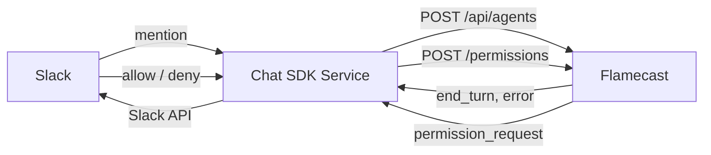

<Info>
  This is a design proposal, not a shipped feature. Feedback is welcome on [GitHub](https://github.com/anthropics/flamecast).
</Info>

## Problem

Flamecast currently requires a persistent WebSocket connection to receive session events. This works well for browser UIs and long-lived server processes, but it blocks an important class of integrations:

- **Serverless functions** (Vercel, AWS Lambda, Cloudflare Workers) that have execution time limits
- **Chat platform bots** (Slack, Discord, Teams) where the bot handler is invoked per-message and can't hold a WebSocket open for hours
- **Workflow orchestrators** that trigger agent sessions and want to be notified on completion without polling

Agent sessions can run for minutes or hours. A Slackbot that holds a WebSocket open for the duration of each session requires a dedicated long-lived process — defeating the purpose of serverless deployment.

## Proposed solution: session webhooks

Allow clients to register a webhook URL when creating a session. Flamecast delivers events as HTTP POST requests to that URL instead of (or in addition to) the WebSocket stream.

### Creating a session with webhooks

Pass a single webhook to receive all events:

```bash
curl -X POST http://localhost:3001/api/agents \
  -H "Content-Type: application/json" \
  -d '{
    "agentTemplateId": "codex",
    "cwd": "/path/to/project",
    "webhooks": [
      {
        "url": "https://my-app.vercel.app/api/agent-events",
        "secret": "whsec_abc123"
      }
    ]
  }'
```

Or register multiple webhooks filtered by event type:

```bash
curl -X POST http://localhost:3001/api/agents \
  -H "Content-Type: application/json" \
  -d '{
    "agentTemplateId": "codex",
    "cwd": "/path/to/project",
    "webhooks": [
      {
        "url": "https://my-app.vercel.app/api/agent-events",
        "secret": "whsec_abc123",
        "events": ["end_turn", "error"]
      },
      {
        "url": "https://my-app.vercel.app/api/permissions",
        "secret": "whsec_def456",
        "events": ["permission_request"]
      }
    ]
  }'
```

| Field | Type | Description |
|---|---|---|
| `webhooks` | `array` | One or more webhook registrations |
| `webhooks[].url` | `string` | HTTPS endpoint that receives POST requests |
| `webhooks[].secret` | `string` | Shared secret used to sign payloads for verification |
| `webhooks[].events` | `string[]` | Optional event filter. When omitted, all events are delivered |

### Event delivery format

Each event is delivered as an HTTP POST with a JSON body:

```http
POST /api/agent-events HTTP/1.1
Content-Type: application/json
X-Flamecast-Signature: sha256=abc123...
X-Flamecast-Session-Id: session-456
X-Flamecast-Event-Id: evt-789

{
  "sessionId": "session-456",
  "eventId": "evt-789",
  "timestamp": "2025-03-24T10:30:00Z",
  "event": {
    "type": "end_turn",
    "data": {
      "messages": [
        {
          "role": "assistant",
          "content": [
            { "type": "text", "text": "I've fixed the bug in auth.ts. The issue was..." }
          ]
        }
      ]
    }
  }
}
```

### Signature verification

Every webhook POST is signed using HMAC-SHA256 with the shared secret. The receiver verifies the signature before processing:

```typescript
import { createHmac } from "node:crypto";

function verifyWebhook(body: string, signature: string, secret: string): boolean {
  const expected = "sha256=" + createHmac("sha256", secret)
    .update(body)
    .digest("hex");
  return signature === expected;
}
```

### Event types

Webhooks support three event types:

| Event type | Description |
|---|---|
| `end_turn` | The agent finished processing and is waiting for input. Includes the full conversation history for the turn |
| `permission_request` | The agent is requesting user approval before proceeding |
| `error` | The agent encountered an error |

Unlike the WebSocket stream which delivers granular `agent_message_chunk` events, webhooks deliver coalesced `end_turn` events with the complete turn content. This dramatically reduces webhook volume — one POST per turn instead of hundreds of chunk events.

### Responding to permission requests

When a `permission_request` event arrives via webhook, the receiver responds by calling the REST API:

```typescript
// In your webhook handler
export async function POST(req: Request) {
  const event = await req.json();

  if (event.event.type === "permission_request") {
    const permission = event.event.data;

    // Auto-approve, or store for later human review
    await fetch(
      `${FLAMECAST_URL}/api/agents/${event.sessionId}/permissions/${permission.requestId}`,
      {
        method: "POST",
        headers: { "Content-Type": "application/json" },
        body: JSON.stringify({ optionId: "allow" }),
      }
    );
  }

  return new Response("ok");
}
```

<Note>
  This requires a new REST endpoint `POST /api/agents/:id/permissions/:requestId` for responding to permission requests outside of a WebSocket connection. This endpoint does not exist yet.
</Note>

### Sending prompts without WebSocket

Similarly, a new REST endpoint would allow sending prompts without a WebSocket connection:

```bash
curl -X POST http://localhost:3001/api/agents/session-456/prompts \
  -H "Content-Type: application/json" \
  -d '{ "text": "Fix the bug in auth.ts" }'
```

Together, webhooks + REST prompt/permission endpoints enable fully stateless agent orchestration.

## Delivery guarantees

### At-least-once delivery

Flamecast retries failed webhook deliveries with exponential backoff:

| Attempt | Delay |
|---|---|
| 1 | Immediate |
| 2 | 5 seconds |
| 3 | 30 seconds |
| 4 | 2 minutes |
| 5 | 10 minutes |

A delivery is considered successful if the endpoint returns a `2xx` status code within 10 seconds. After all retries are exhausted, the event is logged as undeliverable.

### Ordering

Events are delivered in order per session, but delivery is not transactional. If a webhook endpoint is slow, events may queue up. Each event includes a monotonic `eventId` so receivers can detect gaps or reorder if needed.

### Idempotency

The `X-Flamecast-Event-Id` header is a unique, stable identifier for each event. Receivers should use it to deduplicate retried deliveries.

## Example: stateless Slackbot

With webhooks, a Slackbot can run entirely as a stateless [Chat SDK](https://chat-sdk.dev) service:



The Chat SDK service handles four routes — all stateless request handlers in the same service:

- **Slack mention** — creates a Flamecast session with two webhooks
- **`/api/agent-events`** — receives `end_turn` and `error` events, posts results to Slack
- **`/api/agent-permissions`** — receives `permission_request` events, prompts the user in-thread
- **Slack thread reply** — resolves pending permission requests via the Flamecast REST API

```typescript
// Chat SDK service

// Route: Slack mention — creates a Flamecast session
async function handleMention(slackEvent: any) {
  const threadId = slackEvent.event.thread_ts || slackEvent.event.ts;

  // Create a Flamecast session with a webhook pointing back to this service
  const session = await fetch(`${FLAMECAST_URL}/api/agents`, {
    method: "POST",
    headers: { "Content-Type": "application/json" },
    body: JSON.stringify({
      agentTemplateId: "codex",
      webhooks: [
        {
          url: "https://my-app.vercel.app/api/agent-events",
          secret: process.env.WEBHOOK_SECRET,
          events: ["end_turn", "error"],
        },
        {
          url: "https://my-app.vercel.app/api/agent-permissions",
          secret: process.env.WEBHOOK_SECRET,
          events: ["permission_request"],
        },
      ],
    }),
  }).then((r) => r.json());

  // Store the session-to-thread mapping in your database
  await db.put(session.id, { threadId, channel: slackEvent.event.channel });

  // Send the initial prompt
  await fetch(`${FLAMECAST_URL}/api/agents/${session.id}/prompts`, {
    method: "POST",
    headers: { "Content-Type": "application/json" },
    body: JSON.stringify({ text: slackEvent.event.text }),
  });
}

// Route: /api/agent-events — receives end_turn and error events
async function handleAgentEvents(req: Request) {
  const body = await req.text();
  const signature = req.headers.get("X-Flamecast-Signature")!;

  if (!verifyWebhook(body, signature, process.env.WEBHOOK_SECRET!)) {
    return new Response("invalid signature", { status: 401 });
  }

  const event = JSON.parse(body);

  const mapping = await db.get(event.sessionId);
  if (!mapping) return new Response("ok");

  if (event.event.type === "end_turn") {
    const lastMessage = event.event.data.messages.at(-1);
    const text = lastMessage?.content
      ?.filter((c: any) => c.type === "text")
      .map((c: any) => c.text)
      .join("\n");

    await slackClient.chat.postMessage({
      channel: mapping.channel,
      thread_ts: mapping.threadId,
      text,
    });
  }

  if (event.event.type === "error") {
    await slackClient.chat.postMessage({
      channel: mapping.channel,
      thread_ts: mapping.threadId,
      text: `Agent error: ${event.event.data.message}`,
    });
  }

  return new Response("ok");
}

// Route: /api/agent-permissions — receives permission_request events
async function handleAgentPermissions(req: Request) {
  const body = await req.text();
  const signature = req.headers.get("X-Flamecast-Signature")!;

  if (!verifyWebhook(body, signature, process.env.WEBHOOK_SECRET!)) {
    return new Response("invalid signature", { status: 401 });
  }

  const event = JSON.parse(body);

  const mapping = await db.get(event.sessionId);
  if (!mapping) return new Response("ok");

  const { requestId, title, description } = event.event.data;

  // Store the pending permission so the reply handler can resolve it
  await db.put(`perm:${mapping.threadId}`, {
    sessionId: event.sessionId,
    requestId,
  });

  await slackClient.chat.postMessage({
    channel: mapping.channel,
    thread_ts: mapping.threadId,
    text: [
      `*Permission request:* ${title}`,
      description,
      'Reply *"allow"* or *"deny"* in this thread.',
    ].join("\n"),
  });

  return new Response("ok");
}

// Route: Slack thread reply — resolves permission requests
async function handleReply(slackEvent: any) {
  const text = slackEvent.event.text?.trim().toLowerCase();
  const threadId = slackEvent.event.thread_ts;

  if (!threadId || !["allow", "deny"].includes(text)) return;

  const pending = await db.get(`perm:${threadId}`);
  if (!pending) return;

  // Respond to the permission request via Flamecast REST API
  await fetch(
    `${FLAMECAST_URL}/api/agents/${pending.sessionId}/permissions/${pending.requestId}`,
    {
      method: "POST",
      headers: { "Content-Type": "application/json" },
      body: JSON.stringify({ optionId: text === "allow" ? "allow" : "deny" }),
    }
  );

  await db.delete(`perm:${threadId}`);

  await slackClient.chat.postMessage({
    channel: slackEvent.event.channel,
    thread_ts: threadId,
    text: text === "allow" ? "Approved. Agent is continuing." : "Denied. Agent will skip this action.",
  });
}
```

## Open questions

1. **Webhook management API.** Should webhooks be updateable after session creation? For example, `PATCH /api/agents/:id/webhook` to change the URL.

   *Proposed: Yes.* Clients should be able to update or remove a webhook after session creation.

2. **Multiple webhooks.** Should a session support multiple webhook endpoints (e.g. one for logging, one for the Slackbot)?

   *Proposed: Yes.* The `webhooks` field accepts an array of registrations, each with its own URL, secret, and optional event filter. This is reflected in the API design above.

3. **Dead letter queue.** What happens to events that fail all retries? Should Flamecast expose an API to replay failed events?

4. **Backpressure.** If the webhook endpoint is consistently slow, should Flamecast buffer events, drop them, or pause the agent?

   *Proposed: Pause the agent.* If the webhook endpoint cannot keep up, Flamecast should pause the agent until delivery succeeds, rather than dropping events or buffering indefinitely.
