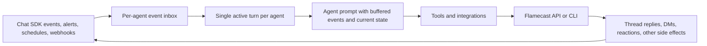

# RFC: Programmable Agent Chat Loop

Status: Draft
Date: 2026-03-20

## Summary

Flamecast should treat chat as just another integration.

Incoming chat messages are events in an agent inbox. Outbound replies, DMs, reactions, and thread posts are actions the agent performs by calling the Flamecast API or CLI, just like it would call any other integration.

The runtime should not hardcode response behavior. The system prompt should carry guidelines. The tool layer should carry capabilities.

## Goals

- Let agents choose whether, where, and how to respond.
- Keep response behavior programmable in prompts rather than server-side branching.
- Make chat one surface among many, not a special-case runtime.
- Support proactive behavior, such as DMing a user when an alert or prod issue appears.
- Preserve a simple loop that works with modern agents that support steering mode.

## Non-Goals

- Hardcoding product policy like "always reply on mention" into the core runtime.
- Building chat-specific logic that agents cannot override through prompting.
- Solving advanced multi-agent scheduling in this RFC.

## Proposal

Each agent owns a durable event inbox.

All external stimuli append events to that inbox:

- chat messages
- mentions
- DMs
- prod alerts
- webhooks
- scheduled ticks
- permission outcomes
- tool results

Only one turn runs per agent at a time. If the agent is busy, new events stay buffered.

When the current turn finishes, Flamecast sends the buffered events into the next prompt turn. Most modern agents support steering mode, so this is a reasonable first architecture.

The agent is given access to integrations, including Flamecast itself. Chat responses are not a special server-side action. They are tool actions performed by the agent:

- reply in a thread
- DM a user
- react to a message
- create a follow-up thread
- stay silent

If the agent wants to respond, it does so by calling Flamecast over `curl` or a CLI. If it wants to stay silent, it simply does not make a visible chat call.

## Architecture

## Design Principles

### 1. Chat Is Not Special

Chat input is an event. Chat output is an integration action. This keeps the model consistent with non-chat integrations.

### 2. Policy Lives in the Prompt

Guidelines about when to speak, when to DM, when to summarize, when to escalate, and when to stay quiet belong in the system prompt, not in deep runtime logic.

### 3. Capability Lives in Tools

The runtime gives agents the tools to act. The agent decides how to use them.

### 4. Proactivity Falls Out Naturally

A prod alert, deploy event, or scheduled check is just another inbox event. The same agent can decide to DM the user, post in a team thread, or do nothing.

### 5. Runtime Logic Stays Minimal

The runtime is responsible for buffering, scheduling, ordering, and tool access. It is not responsible for deciding the agent's communication strategy.

## Required Runtime Guarantees

- Durable per-agent event buffering.
- At most one active turn per agent.
- Buffered events delivered into later turns if the agent is busy.
- Flamecast API or CLI available to the agent like any other integration.
- Prompt context includes current buffered events and enough state to act coherently.
- Rate limits, auth, and permissions enforced by the runtime and integrations.

## Why This Shape

This design maximizes programmability.

It makes agent behavior highly customizable through prompting.

It allows the same agent to be reactive or proactive without separate systems.

It avoids baking fragile chat-product assumptions into core orchestration.

It also matches the simple architecture we want today: buffered events, steering-mode prompts, and broad tool access.

## Open Questions

- What batching window should group buffered events into one turn?
- How should we handle interrupts while the agent is still generating text?
- What minimum Flamecast chat actions should be exposed first?
- What safety defaults should apply to proactive DMs?
