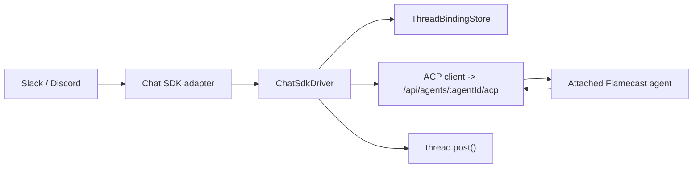

# RFC: Chat SDK Driver

## Executive Summary

Flamecast v1 chat integration is a single driver at `plugins/chat-sdk`.

The driver is attached to one Flamecast `agentId`. It uses Chat SDK so Flamecast does not need to implement its own Slack or Discord webhook parsing, verification, thread model, dedupe, or reply API.

The mapping is strict and simple:

- one Chat SDK `thread.id` maps to one ACP `sessionId`,
- a new thread creates a new ACP session,
- later messages in that thread reuse the same ACP session,
- replies go back through `thread.post()`.

V1 does not introduce a generic connector platform or a separate connector service.

## Motivation

We want Flamecast to speak through Slack and Discord, but we do not want to rebuild chat-platform plumbing.

Chat SDK already provides:

- provider adapters,
- webhook parsing and verification,
- normalized `Thread` and `Message` objects,
- thread subscriptions,
- dedupe and locking through its state adapter,
- unified reply posting.

Flamecast should only own the agent-side concerns:

- ACP session creation,
- ACP prompting,
- permission handling,
- durable thread-to-session bindings.

## Proposal

### Goals

- Use Chat SDK as the chat ingress layer.
- Ship one driver in `plugins/chat-sdk`.
- Attach each driver instance to one specific `agentId`.
- Keep a 1:1 mapping between Chat SDK threads and ACP sessions.
- Support Slack and Discord through Chat SDK adapters.
- Keep the runtime model small enough to implement quickly.

### Non-Goals

- A generic connector service.
- A provider-agnostic event bus.
- Separate Slack and Discord driver implementations in v1.
- Non-chat integrations such as Sentry or observability systems.
- Rich chat UI features such as cards, modals, or streaming edits.
- Chat-native permission approval.

## Architecture



### Core Components

V1 has only three moving parts beyond Chat SDK itself:

- `ChatSdkDriver`
- `ThreadBindingStore`
- `AcpClient`

### Driver Shape

```ts
type ChatSdkDriverSpec = {
  id: string;
  agentId: string;
  cwd: string;
  userName: string;
  adapters: Record<string, Record<string, unknown>>;
  state: {
    kind: "redis" | "postgres" | "ioredis";
    config: Record<string, unknown>;
  };
};

type ChatSdkDriver = {
  start(): Promise<void>;
  stop(): Promise<void>;
  webhooks: Record<string, (request: Request) => Promise<Response>>;
};
```

The driver is stateful. It owns:

- one Chat SDK `Chat` instance,
- one ACP client connection to the attached `agentId`,
- access to the thread binding store.

There is no separate connector orchestration layer.

### Thread Binding Store

```ts
type ThreadBindingStore = {
  get(driverId: string, threadId: string): Promise<string | null>;
  set(driverId: string, threadId: string, sessionId: string): Promise<void>;
  touch(driverId: string, threadId: string): Promise<void>;
};
```

Minimal storage table:

| Column | Purpose |
| --- | --- |
| `driver_id` | Driver instance |
| `thread_id` | Chat SDK thread identifier |
| `session_id` | ACP session identifier |
| `created_at` | Binding creation time |
| `last_seen_at` | Last message time |

`(driver_id, thread_id)` is unique.

`agentId` lives on the driver config, not on every binding row.

### ACP Client

```ts
type AcpClient = {
  connect(agentId: string): Promise<void>;
  newSession(cwd: string): Promise<string>;
  prompt(sessionId: string, text: string): Promise<string>;
};
```

The ACP client talks only to the attached agent. It does not do routing.

## Chat SDK Integration

The driver uses Chat SDK to avoid custom parsing and platform-specific request handling.

Representative shape:

```ts
const bot = new Chat({
  userName: spec.userName,
  adapters: createAdapters(spec.adapters),
  state: createStateAdapter(spec.state),
});

bot.onNewMention(async (thread, message) => {
  await thread.subscribe();
  await handleThreadMessage(thread, message);
});

bot.onSubscribedMessage(async (thread, message) => {
  await handleThreadMessage(thread, message);
});
```

The shared handler does the real work:

```ts
async function handleThreadMessage(thread: Thread, message: Message) {
  let sessionId = await bindings.get(spec.id, thread.id);

  if (!sessionId) {
    sessionId = await acp.newSession(spec.cwd);
    await bindings.set(spec.id, thread.id, sessionId);
  }

  const prompt = encodePrompt(thread, message);
  const reply = await acp.prompt(sessionId, prompt);
  await bindings.touch(spec.id, thread.id);
  await thread.post(reply);
}
```

Important consequences:

- Chat SDK owns platform normalization.
- Chat SDK `thread.id` is the only external identity Flamecast cares about.
- Flamecast never parses raw Slack or Discord payloads itself.

## Prompt Format

Each chat message becomes a simple text prompt:

````text
You received a chat message through the Flamecast Chat SDK driver.

Metadata:
```json
{
  "threadId": "slack:C123:171234.000200",
  "platform": "slack",
  "userId": "slack:U456",
  "userName": "alice"
}
```

Message:
Can you summarize the deployment failure in this thread?
````

The ACP session is the conversation memory. The driver does not replay the full thread history every turn.

## Runtime Flow

### New Thread

1. A Slack or Discord webhook reaches the driver.
2. Chat SDK verifies and parses the request.
3. Chat SDK hands the driver a normalized `thread` and `message`.
4. The driver subscribes to the thread if needed.
5. The driver looks up `thread.id`.
6. If no binding exists, the driver creates a new ACP session on the attached agent.
7. The driver stores `thread.id -> sessionId`.
8. The driver prompts that ACP session.
9. The driver posts the reply with `thread.post()`.

### Existing Thread

1. Chat SDK delivers a normalized message for a subscribed thread.
2. The driver resolves `thread.id -> sessionId`.
3. The driver prompts that ACP session.
4. The driver posts the reply with `thread.post()`.

## Concurrency

We keep this minimal by relying on Chat SDK’s own state adapter for:

- dedupe,
- per-thread locking,
- subscription state.

V1 does not add another delivery queue or orchestration service.

If prompt overlap becomes a real issue, the driver can add a tiny in-process queue keyed by `thread.id`, but that is not part of the base design.

## Boundaries

### Chat SDK Owns

- Slack and Discord request parsing,
- signature verification,
- normalized thread/message interfaces,
- thread subscription behavior,
- message dedupe and locking,
- posting replies.

### Flamecast Owns

- the attached agent,
- ACP session creation,
- ACP prompt delivery,
- session logs,
- permission handling,
- durable `thread.id -> sessionId` bindings.

## Minimal Route Surface

The driver needs only:

- `ALL /api/agents/:agentId/acp`
- `ALL /api/plugins/chat-sdk/:driverId/webhooks/:platform`

Administrative CRUD routes can be added later. They are not required to validate the core design.

## Drawbacks

- The design depends on Chat SDK as a core abstraction.
- One driver is bound to one agent, so scaling may eventually require more driver instances.
- Chat SDK state and Flamecast bindings are two separate persistence layers.
- This design is intentionally chat-specific and does not generalize to non-chat systems.

## Alternatives

### Build Separate SlackDriver and DiscordDriver

This is rejected for v1 because Chat SDK already gives us a shared abstraction and keeps us from rebuilding parsers and request handling.

### Build a Generic Connector Service First

This is rejected for v1 because it solves problems we do not need yet and adds coordination layers before the first driver exists.

### Parse Slack and Discord Webhooks Ourselves

This is rejected because it recreates the exact platform plumbing Chat SDK already solves.

## Open Questions

- Which Chat SDK entrypoints should start a session in v1: mentions only, direct messages, or all inbound thread messages?
- Should inactive thread bindings ever be garbage-collected automatically?
- Should the driver post a placeholder or typing indicator before the ACP reply completes?

## Conclusion

The minimalist design is one `ChatSdkDriver` under `plugins/chat-sdk`, backed by one small binding store and one ACP client. Chat SDK handles Slack and Discord parsing so Flamecast does not need its own parser layer. Flamecast only maps `thread.id` to `sessionId` on a specific attached agent and posts the agent reply back into the same thread.
